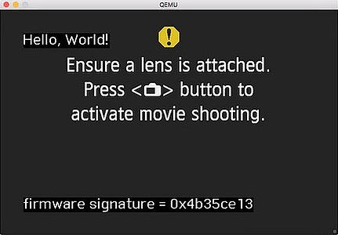

How can I run Magic Lantern in QEMU?
====================================

This guide shows you how to emulate Magic Lantern (or plain Canon firmware) in QEMU.

Eager to get started? Scroll down to `Installation`_.

.. class:: align-center

|pic1| |pic2|

.. |pic1| image:: doc/img/qemu-60D.png
    :width: 30 %


Current state
-------------

What works:

- Canon GUI with menu navigation — most DIGIC 3, 4 and 5 models,
- Limited support for DIGIC 2, 6 and 7 models
- Limited support for some PowerShot models (including recent EOS M models)
- Limited support for secondary DryOS cores (such as Eeko or 5D4 AE processor)
- File I/O works on most models (both SD and CF); might be unreliable
- Bootloader emulation works on all supported models (from DIGIC 2 to DIGIC 7)
- Loading AUTOEXEC.BIN / DISKBOOT.BIN from the virtual SD/CF card (from DIGIC 2 to DIGIC 6)
- Unmodified autoexec.bin works on many single-core camera models
  (and, with major limitations, on dual-core models)
- ML modules and Lua scripts (within the limitations of the emulation)
- DryOS/VxWorks timer (heartbeat) and task switching (all supported models)
- UART emulation (DryOS shell aka Dry-shell or DrySh on DIGIC 4, 5 and 6 models)
- Deterministic execution with the ``-icount`` option (SD models only)
- Cache hacks are emulated to some extent (but "uninstalling" them does not work)
- EDMAC memcpy, including geometry parameters (matches the hardware closely, but not perfectly)
- Debugging with GDB:

  - assembly level for Canon code
  - source level for ML code (if compiled with -ggdb3 or similar)
  - ML stubs can be loaded as debugging symbols for Canon code (todo: also import from IDA or other systems)
  - predefined GDB scripts (log calls to DebugMsg, task_create, register_interrupt and a few others)
  - front-ends tested: cgdb (``splitgdb.sh``), DDD, gdbgui

  |

- Debug messages at QEMU console:

  - Use qprintf / qprint / qprintn / qdisas for printing to QEMU console
  - Compile Magic Lantern with ``CONFIG_QEMU=y``
  - By default (``CONFIG_QEMU=n``), the debug messages are not compiled
    (therefore not increasing the size of the executable that runs on the camera)

  |

- Log various actions of the guest operating system (Canon firmware, ML):

  - execution trace: ``-d exec,nochain -singlestep``
  - I/O trace: ``-d io``, ``-d io,int``
  - log hardware devices: ``-d mpu/sflash/sdcf/uart/int``
  - log all debug messages from Canon: ``-d debugmsg``
  - log all memory accesses: ``-d rom/ram/romr/ramw/etc``
  - log all function calls: ``-d calls``, ``-d calls,tail``
  - log all DryOS/VxWorks task switches: ``-d tasks``
  - track all function calls to provide a stack trace: ``-d callstack``
  - export all called functions to IDC script: ``-d idc``
  - identify memory blocks copied from ROM to RAM: ``-d romcpy``
  - check for memory errors (a la valgrind): ``-d memchk``
  - list all available items: ``-d help`` 

What does not work (yet):

- LiveView (WIP, very hard);
- Still photo capture (WIP — the capture process itself works);
- Image review (WIP);
- Dual core emulation aka IPC (WIP);
- Touch screen (TODO);
- Flash reprogramming (TODO, low priority);
- Most hardware devices (audio chip, ADTG, FPGAs, JPCORE, image processing engine...);
- MPU properties are working to some extent, but have major limitations and bugs;
- Lens communication (done via MPU); initial lens info is replayed on startup on some models, but that's pretty much it;
- Cache behavior is not emulated (very hard; feel free to point us to code that can be reused);
- Native Windows build (QEMU can be compiled on Windows => contribution welcome).

Common issues and workarounds
`````````````````````````````

- Camera was not shut down cleanly — Skipping module loading

  - closing QEMU window does not perform a clean shutdown
  - ``Machine -> Power Down`` — see `Shutdown and reboot`_ for more info
  - quicker: press ``C`` to "open" the card door => also clean shutdown.

  |

- dm-spy-experiments: saving the log and anything executed afterwards may not work

  - issue: cache hacks are not emulated very well
  - workaround: compile with ``CONFIG_QEMU=y``

  |

.. _netcat-issue:

- Netcat issues when interacting with ``qemu.monitor``

  There are many versions of netcat around.
  Newer variants of openbsd netcat
  (`since 1.111, Mar 2013 <https://cvsweb.openbsd.org/cgi-bin/cvsweb/src/usr.bin/nc/netcat.c.diff?r1=1.110&r2=1.111&f=h>`_)
  require ``-N``, but older versions do not have ``-N`` and will print an error if you attempt to use it. GNU netcat or other variants were not tested.
  
  TLDR: try openbsd netcat. If you get an error after copy/pasting some ``nc`` command from this guide, simply remove the ``-N``.
  
  Look in ``run_tests.sh`` for a slightly more portable workaround.
  

Installation
------------

It is recommended to install from the `qemu <https://bitbucket.org/hudson/magic-lantern/branch/qemu>`_
branch, as it will contain the latest developments. The installation will be performed
outside the main magic-lantern directory, therefore you will be able to emulate any ML branch
without additional gymnastics (you will **not** have to merge ``qemu`` into your working branch or worry about it).

1. Clone the ``magic-lantern`` repository if you haven't already:

   .. code:: shell

     hg clone https://bitbucket.org/hudson/magic-lantern
     cd magic-lantern

   |

2. Run ``install.sh`` from the ``qemu`` branch:

   .. code:: shell

     /path/to/magic-lantern$  hg update qemu -C
     /path/to/magic-lantern$  cd contrib/qemu
     /path/to/magic-lantern/contrib/qemu$  ./install.sh

   |

3. Follow the instructions; you will have to supply your ROM files and compile QEMU:

   .. code:: shell

     # replace camera model (60D) with yours
     /path/to/qemu$  cp /path/to/sdcard/ML/LOGS/ROM*.BIN 60D/
     /path/to/qemu$  cd qemu-2.5.0
     /path/to/qemu/qemu-2.5.0$  ../configure_eos.sh
     /path/to/qemu/qemu-2.5.0$  make -j2
     /path/to/qemu/qemu-2.5.0$  cd ..

   Some recent camera models also use a serial flash. To list them, run this command:

   .. code:: shell
   
     cat qemu-2.5.0/hw/eos/model_list.c | grep -B 10 serial_flash_size | grep -E "\.(serial_flash_size|name) "

   or just watch out for an error about missing ``SFDATA.BIN`` when trying the next step.

   If your camera requires a serial flash, compile the 
   `sf_dump module <https://bitbucket.org/hudson/magic-lantern/src/unified/modules/sf_dump>`_
   and run it on your camera to get this file.
   
   |

4. Test your installation.

   The pre-installed SD/CF images come with a small autoexec.bin
   (the `portable display test <http://www.magiclantern.fm/forum/index.php?topic=14732.0>`_)
   that works on all supported EOS models. It does not work on PowerShot models
   (including recent EOS M models based on PowerShot firmware).

   .. code:: shell
 
     # all EOS models should run this without any trickery
     /path/to/qemu$  ./run_canon_fw.sh 60D,firmware="boot=1"

   |

5. Compile and run Magic Lantern

   .. code:: shell

     # from the QEMU directory
     /path/to/qemu$  make -C ../magic-lantern 60D_install_qemu
     
     # some models will work only with this:
     /path/to/qemu$  ./run_canon_fw.sh 60D,firmware="boot=1"

     # some models require running under GDB (they won't boot the GUI otherwise)
     /path/to/qemu$  ./run_canon_fw.sh EOSM,firmware="boot=1" -s -S & arm-none-eabi-gdb -x EOSM/patches.gdb -ex quit

   |

For reference, you may also look at `our test suite <http://builds.magiclantern.fm/jenkins/view/QEMU/job/QEMU-tests/lastSuccessfulBuild/console>`_,
where QEMU is installed from scratch every time the tests are run.
These logs can be very useful for troubleshooting.

While we don't provide a native Windows build yet,
it is possible to install QEMU and ML development tools
`under the Windows 10 Linux Subsystem (WSL) <http://www.magiclantern.fm/forum/index.php?topic=20214.0>`_.

Running Canon firmware
----------------------

From the QEMU directory, use the ``run_canon_fw.sh`` script and make sure
the `boot flag <http://magiclantern.wikia.com/wiki/Bootflags>`_ is disabled:

.. code:: shell

  # from the qemu directory
  ./run_canon_fw.sh 60D,firmware="boot=0"

Some models may need additional patches to run — these are stored under ``CAM/patches.gdb``.
To emulate these models, you will also need arm-none-eabi-gdb:

.. code:: shell

  ./run_canon_fw.sh EOSM,firmware="boot=0" -s -S & arm-none-eabi-gdb -x EOSM/patches.gdb -ex quit

You'll probably want to `see a few internals`__ as well. To get started, try these:

__ `Tracing guest events (execution, I/O, debug messages, RAM, function calls...)`_

.. code:: shell

  ./run_canon_fw.sh 60D,firmware="boot=0" -d debugmsg
  ./run_canon_fw.sh 60D,firmware="boot=0" -d debugmsg,tasks
  ./run_canon_fw.sh 60D,firmware="boot=0" -d debugmsg,io
  ./run_canon_fw.sh 60D,firmware="boot=0" -d io,int
  ./run_canon_fw.sh 60D,firmware="boot=0" -d help

Or you may want to `run the firmware under GDB`__ and log additional functions:

__ `Debugging with GDB`_

.. code:: shell

  ./run_canon_fw.sh 60D,firmware="boot=0" -s -S & arm-none-eabi-gdb -x 60D/debugmsg.gdb

Running Magic Lantern
---------------------

As you already know, Magic Lantern runs from the SD or CF card. For emulation,
we provide two card images (sd.img and cf.img) which you can mount on your operating system
and copy files on them. If these images use a FAT filesystem (they do, by default), we prefer 
`mtools <https://www.gnu.org/software/mtools/>`_ for automated tasks
(such as copying files to/from the card images without mounting them).

To install Magic Lantern to the virtual card, you may:

- mount the card image (sd.img or cf.img) as /whatever/EOS_DIGITAL,
  then run ``make install`` from your platform directory:

  .. code:: shell

    # from the magic-lantern directory
    cd platform/60D.111
    make clean; make
    # make sure your virtual card is mounted (this step is operating system specific)
    make install
    # make sure your virtual card is no longer mounted

  |

- use ``make install_qemu`` from your platform directory, or ``make CAM_install_qemu`` 
  or ``make CAM.FW_install_qemu`` from your ML root directory
  (requires mtools, but you do not have to mount your card images;
  works since `27f4105 <https://bitbucket.org/hudson/magic-lantern/commits/27f4105cfa83>`_):

  .. code:: shell

    # from the magic-lantern directory
    cd platform/60D.111
    make clean; make
    make install_qemu

  .. code:: shell

    # from the magic-lantern directory
    make 60D_clean
    make 60D_install_qemu

  They also work from the qemu directory:

  .. code:: shell

    # from the qemu directory
    make -C ../magic-lantern/platform/60D.111 clean
    make -C ../magic-lantern/platform/60D.111 install_qemu

  .. code:: shell

    # from the qemu directory
    make -C ../magic-lantern 5D3.113_clean
    make -C ../magic-lantern 5D3.113_install_qemu

  Please note: ``make install_qemu`` is a recent addition and may not be available in all branches.
  In this case, you may either use the first method, or sync with the "unified" branch (``hg merge unified``),
  or manually import changeset `27f4105 <https://bitbucket.org/hudson/magic-lantern/commits/27f4105cfa83>`_.
  Unfortunately, these rules won't work from ``Makefile.user``.

The included card images are already bootable for EOS firmwares (but not for PowerShots).

After you have copied Magic Lantern to the card, you may run it from the ``qemu`` directory
(near the ``magic-lantern`` one, at the same level):

.. code:: shell

  # from the qemu directory
  ./run_canon_fw.sh 60D,firmware="boot=1"
  
  # or, if your camera requires patches.gdb:
  ./run_canon_fw.sh EOSM,firmware="boot=1" -s -S & arm-none-eabi-gdb -x EOSM/patches.gdb -ex quit

Navigating menus
````````````````

Press ``F1`` to show the available keys (they are model-specific), or just read them
from the emulation log. Some keys will only send "press" events, while others
will send "press and release" events (this is also model-specific
and printed on the console).

Scrollwheels, if turned very quickly, may send a single event that includes
more than one click. This complicates scrollwheel handling code on ML side
and often leads to subtle issues. Currently, this behavior is not emulated.

Shutdown and reboot
```````````````````

By default, closing the QEMU window is equivalent to unplugging the power cord
(if your camera is on external power source). This appears to be the default
with other operating systems as well, so we did not change it.

Please note: closing QEMU window is **not** equivalent to taking the battery out —
see `Opening the battery door`_ for details.

Shutting down
'''''''''''''

To perform a clean shutdown (similar to powering down the camera from the main switch),
you may:

- select ``Machine -> Power Down`` from the menu (QEMU window)
- send the ``system_powerdown`` command to QEMU monitor:

.. code:: shell

  echo "system_powerdown" | nc -N -U qemu.monitor

Internally, Canon code refers to this kind of shutdown as ``SHUTDOWN_REQUEST``
(watch their debug messages with ``-d debugmsg``).

Caveat: the ``system_powerdown`` event does not guarantee a shutdown will actually occur
(either because the firmware handles this event in a different way, or if the execution
gets stuck for any reason). As a workaround, you could issue the ``quit`` command
after some timeout, if QEMU is still running:

.. code:: shell

  echo "system_powerdown" | nc -N -U qemu.monitor
  sleep 2
  if nc -N -U qemu.monitor < /dev/null > /dev/null 2>&1; then
    echo "quit" | nc -N -U qemu.monitor
  fi

Opening the card door
'''''''''''''''''''''

Opening the SD/CF card door is a clean (non-rushed) way to shut down Canon firmware (``SHUTDOWN_REQUEST``).
To emulate this kind of shutdown, press ``C`` to simulate opening the card door,
then wait for a few seconds for QEMU to shutdown.

Opening the card door and closing it back quickly enough may result
in shutdown being canceled. Closing the card door is not implemented,
therefore this behavior is not emulated yet.

Opening the battery door
''''''''''''''''''''''''

Opening the battery door is interpreted by Canon firmware as an emergency shutdown (``PROP_ABORT``),
but it's still a clean(ish) shutdown. To emulate this kind of shutdown, press ``B``,
then close the QEMU window manually (or send the ``quit`` command to QEMU monitor).
Currently we do not know how to trigger or recognize a hardware shutdown event.

Rebooting
'''''''''

The camera can be rebooted from software by triggering ``PROP_REBOOT``.
Canon firmware handles it as a regular shutdown (``SHUTDOWN_REQUEST``),
followed by a regular boot. In QEMU, triggering ``PROP_REBOOT`` from software
will perform a clean shutdown (rebooting is not implemented).

Running ML Lua scripts
``````````````````````

- Install ML on the virtual SD card:

  .. code:: shell

    # from the qemu directory
    wget http://builds.magiclantern.fm/jenkins/job/lua_fix/431/artifact/platform/60D.111/magiclantern-lua_fix.2017Dec23.60D111.zip
    unzip magiclantern-lua_fix.2017Dec23.60D111.zip -d ml-tmp
    ./mtools_copy_ml.sh ml-tmp
    rm -rf ml-tmp/

  |

- Run QEMU:

  .. code:: shell

    ./run_canon_fw.sh 60D,firmware="boot=1"

  |

- enable the Lua module
- reboot the virtual camera cleanly (menu: Machine -> Power Down, then start it again)
- run the Hello World script

Note: api_test.lua does not run completely, but `can be patched <http://www.magiclantern.fm/forum/index.php?topic=2864.msg195347#msg195347>`_.

TODO: make api_test.lua run, fix bugs, polish the guide.

Using multiple firmware versions
````````````````````````````````

In most cases, Magic Lantern only supports one firmware version, to keep things simple.
However, there may be good reasons to support two firmware versions
(for example, on the 5D Mark III, there are valid reasons to choose
both `1.1.3 <http://www.magiclantern.fm/forum/index.php?topic=14704.0>`_
and `1.2.3 <http://www.magiclantern.fm/forum/index.php?topic=11017.0>`_)
or you may want to test both versions when porting Magic Lantern
`to a newer Canon firmware <http://www.magiclantern.fm/forum/index.php?topic=19417.0>`_.

The invocation looks like this (notice the ``113``):

.. code:: shell

  ./run_canon_fw.sh 5D3,firmware="113;boot=0" -s -S & arm-none-eabi-gdb -x 5D3/debugmsg.gdb

And the directory layout should be like this::

  /path/to/qemu/5D3/113/ROM0.BIN
  /path/to/qemu/5D3/113/ROM1.BIN
  /path/to/qemu/5D3/123/ROM0.BIN
  /path/to/qemu/5D3/123/ROM1.BIN
  /path/to/qemu/5D3/113/ROM0.BIN
  /path/to/qemu/5D3/debugmsg.gdb  # common to both versions
  /path/to/qemu/5D3/patches.gdb   # common to both versions

Compare this to a camera model where only one firmware version is supported::

  /path/to/qemu/60D/ROM0.BIN
  /path/to/qemu/60D/ROM1.BIN
  /path/to/qemu/5D3/patches.gdb

Note: you may also store ``debugmsg.gdb`` and ``patches.gdb`` under the firmware version subdirectory if you prefer, but other QEMU-related scripts won't pick them up.

Creating custom SD/CF card images
`````````````````````````````````

You may want to run the emulation using the same card contents as on the physical camera
(for example, for troubleshooting). The recommended way is to create an image
of your SD (or CF) card (`tutorial for Windows and Mac <https://thepihut.com/blogs/raspberry-pi-tutorials/17789160-backing-up-and-restoring-your-raspberry-pis-sd-card>`_):

.. code:: shell

  dd if=/dev/your-sd-card of=sd.img bs=1M

and run QEMU from the resulting ``sd.img`` (or ``cf.img``).

Note: you need to copy the raw contents of the entire card, not just one partition. For example:

.. code:: shell

  dd if=/dev/mmcblk0 of=sd.img    # not mmcblk0p1

Running from the physical SD/CF card
````````````````````````````````````
You may also start QEMU from the same card you use in the physical camera — 
this might be useful for troubleshooting issues with Magic Lantern, 
hopefully including certain card compatibility issues.

It is **strongly** recommended to avoid this procedure, unless absolutely needed.
Please consider creating an image of your SD (or CF) card instead, as described above.

If you still wish to run the emulation directly from a physical SD/CF card:

- See `QEMU docs (Using host drives) <https://qemu.weilnetz.de/doc/qemu-doc.html#Using-host-drives>`_
  and make sure you understand `these warnings <https://wiki.archlinux.org/index.php/QEMU#Using_any_real_partition_as_the_single_primary_partition_of_a_hard_disk_image>`_
- Replace ``file=sd.img`` (or ``file=cf.img``) with ``file=/dev/your-sd-card`` in ``run_canon_fw.sh``
- Configure the appropriate permissions and run the emulation as usual.

**Warning: Canon firmware WILL write to the SD/CF card during startup, 
and might even attempt to format it if the filesystem is not recognized,
or because of emulation bugs. 
Be very careful not to give it write access to your physical hard-disk!!!**

Note: the ROM files will not be loaded from the SD/CF card.

Automation
----------

QEMU monitor
````````````

By default, the QEMU monitor console is available by default as a UNIX socket.
That means, during emulation you can interact with it using netcat:

- interactive console

  .. code:: shell

    nc -N -U qemu.monitor

  |

- one-liner commands, usable from scripts:

  .. code:: shell

    echo "log io" | nc -N -U qemu.monitor

  |

- check whether QEMU monitor is active:

  .. code:: shell

    if nc -N -U qemu.monitor < /dev/null > /dev/null 2>&1; then
      ...
    fi

  |

You can redirect the monitor console to stdio with... ``-monitor stdio``.

If you have trouble with these ``nc`` commands, don't forget to check this common `netcat-issue`_.

Taking screenshots
``````````````````

The easiest way is to use the ``screendump`` command from QEMU monitor:

.. code:: shell

  echo "screendump snap.ppm" | nc -N -U qemu.monitor

In the following example, we'll redirect the monitor to stdio
and take a screenshot after 10 seconds.

.. code:: shell

  ( 
    sleep 10
    echo screendump snap.ppm
    echo system_powerdown
  ) | (
    ./run_canon_fw.sh 60D,firmware='boot=0' \
        -monitor stdio
  )

Another option is to use the VNC interface:

.. code:: shell

  ./run_canon_fw.sh 60D,firmware='boot=0' \
        -vnc :1234 &
  sleep 10
  vncdotool -s :1234 capture snap.png
  echo "system_powerdown" | nc -N -U qemu.monitor

Sending keystrokes
``````````````````

From QEMU monitor::

  (qemu) help
  sendkey keys [hold_ms] -- send keys to the VM (e.g. 'sendkey ctrl-alt-f1', default hold time=100 ms)

.. code:: shell

  ( 
    sleep 10
    echo sendkey m
    sleep 1
    echo screendump menu.ppm
    echo system_powerdown
  ) | (
    ./run_canon_fw.sh 60D,firmware='boot=0' \
        -monitor stdio
  )

Or, if QEMU runs as a background process:

.. code:: shell

  ./run_canon_fw.sh 60D,firmware='boot=0' &
  
  sleep 10
  echo "sendkey m" | nc -N -U qemu.monitor
  sleep 1
  echo "screendump menu.ppm" | nc -N -U qemu.monitor
  echo "system_powerdown" | nc -N -U qemu.monitor

From VNC:

.. code:: shell

  vncdotool -h | grep key
  key KEY               send KEY to server, alphanumeric or keysym: ctrl-c, del
  keyup KEY             send KEY released
  keydown KEY           send KEY pressed

.. code:: shell

  ./run_canon_fw.sh 60D,firmware='boot=0' \
        -vnc :1234 &
  sleep 10
  vncdotool -s :1234 key m
  sleep 1
  vncdotool -s :1234 capture menu.png
  echo "system_powerdown" | nc -N -U qemu.monitor

Running multiple ML builds from a single command
````````````````````````````````````````````````

You may run ML builds from multiple models, unattended,
with the ``run_ml_all_cams.sh`` script:

.. code:: shell

  env ML_PLATFORMS="500D.111/ 60D.111/" \
      TIMEOUT=10 \
      SCREENSHOT=1 \
      ./run_ml_all_cams.sh

Internally, this is how the emulator is invoked:

.. code:: shell

  ( 
    sleep 10
    echo screendump 60D.111.ppm
    echo system_powerdown
  ) | (
    ./run_canon_fw.sh 60D,firmware='boot=1' \
        -display none -monitor stdio
  ) &> 60D.111.log


This script is very customizable (see the source code for available options).

More examples:

- `EOSM2 hello world <http://builds.magiclantern.fm/jenkins/view/QEMU/job/QEMU-EOSM2/18/console>`_
- running ML from the dm-spy-experiments branch in the emulator (`QEMU-dm-spy <http://builds.magiclantern.fm/jenkins/view/QEMU/job/QEMU-dm-spy/65/consoleFull>`_)
- running the FA_CaptureTestImage test based on the minimal ML target (`QEMU-FA_CaptureTestImage <http://builds.magiclantern.fm/jenkins/view/QEMU/job/QEMU-FA_CaptureTestImage>`_)

Parallel execution
``````````````````

On modern machines, you will get significant speed gains by running multiple instances of QEMU in parallel.
This is tricky and not automated. You need to be careful with the following global resources:

- SD and CF images (``sd.img`` and ``cf.img``):

  If all your parallel instances require the same initial SD/CF card contents,
  and you do not need to inspect the changes to SD/CF after the experiment,
  you may use these files as read-only shared resources with the help of QEMU's
  `temporary snapshot <https://wiki.qemu.org/Documentation/CreateSnapshot#Temporary_snapshots>`_ feature
  (simply add ``-snapshot`` to your command line). This will discard any changes to ``sd.img`` and ``cf.img``.
  `Implementation details <https://lists.gnu.org/archive/html/qemu-devel/2008-09/msg00712.html>`_.

  Otherwise, you could allocate different SD/CF images for each instance, but it's up to you to modify the scripts to handle that.

- QEMU monitor socket (``qemu.monitor``):

  Set the ``QEMU_JOB_ID`` environment variable; it will be used as suffix for ``qemu.monitor``.
  
  Example: ``QEMU_JOB_ID=1 ./run_canon_fw.sh 5D3`` will use ``qemu.monitor1`` for monitor commands.

- GDB port (with ``-s -S``, this port is 1234):

  Set QEMU_JOB_ID to a small positive integer, for example:

  .. code:: shell

    export QEMU_JOB_ID=1
  
  Then you'll be able to do this:

  .. code:: shell

    QEMU_MONITOR=qemu.monitor$QEMU_JOB_ID
    GDB_PORT=$((1234+$QEMU_JOB_ID))
    ./run_canon_fw.sh EOSM2,firmware="boot=0" -S -gdb tcp::$GDB_PORT &
    arm-none-eabi-gdb -ex "set \$TCP_PORT=$GDB_PORT" -x EOSM2/patches.gdb -ex quit &
    
    # interact with monitor commands
    sleep 5
    echo "sendkey m" | nc -N -U $QEMU_MONITOR
    sleep 1

    # quit when finished
    echo "quit" | nc -N -U $QEMU_MONITOR

  |

- VNC display

  Same as above:

  .. code:: shell

    QEMU_MONITOR=qemu.monitor$QEMU_JOB_ID
    VNC_DISP=":$((12345+QEMU_JOB_ID))"
    ./run_canon_fw.sh 5D3,firmware="boot=0" -vnc $VNC_DISP &
    
    # interact with vncdotool
    sleep 5
    vncdotool -s $VNC_DISP key m
    sleep 1
    
    # quit when finished
    echo "quit" | nc -N -U $QEMU_MONITOR

  |

- any temporary files you may want to use

  Use something like ``mktemp`` rather than hardcoding a filename.
  Or, try to achieve the same thing without a temporary file (pipes, process substitution).

- any other global resources (you'll have to figure them out on your own).

TODO: can this be automated somehow with containers?

Debugging
---------

From the QEMU monitor
`````````````````````

.. code:: shell

  echo "help" | ./run_canon_fw.sh 60D -monitor stdio |& grep dump
  ...
  pmemsave addr size file -- save to disk physical memory dump starting at 'addr' of size 'size'
  xp /fmt addr -- physical memory dump starting at 'addr'

Using ``qprintf`` and friends
`````````````````````````````

The QEMU debugging API
(`qemu-util.h <https://bitbucket.org/hudson/magic-lantern/src/qemu/src/qemu-util.h>`_, included by default by ``dryos.h``)
exposes the following functions to be used in Magic Lantern code:

:qprintf: heavyweight, similar to printf; requires vsnprintf from Canon code
:qprint: lightweight, inline, similar to puts, without newline
:qprintn: lightweight, prints a 32-bit integer
:qdisas: lightweight, tells QEMU to disassemble one ARM or Thumb instruction at the given address

These functions will print to QEMU console whenever ML (or a subset of it)
is compiled with ``CONFIG_QEMU=y``. They won't get compiled in regular builds
(``CONFIG_QEMU=n`` is the default), therefore they won't increase the executable size.
For this reason, feel free to use them *anywhere*.

You may use the debugging API for either the entire ML, or just for a subset of it —
e.g. the source file(s) you are currently editing, or only some modules.
The lightweight functions can also be used in very early boot code,
where you can't call vsnprintf or you may not even have a stack properly set up.

CONFIG_QEMU
```````````

:``CONFIG_QEMU=n``: (default):

- regular build
- the executable works in QEMU (within the limitations of the emulation)
- no guest debugging code (no additional debugging facilities)

:``CONFIG_QEMU=y``: (optional, on the command line or in ``Makefile.user``):

- debug build for QEMU only
- does **not** run on the camera (!)
- enables ``qprintf`` and friends to print to the QEMU console
- enables unlimited number of ROM patches — useful for 
  `dm-spy-experiments <http://www.magiclantern.fm/forum/index.php?topic=2388.0>`_
  (in QEMU you can simply write to ROM as if it were RAM)
- may enable workarounds for models or features that are not emulated very well

Example:

.. code:: shell

    cd platform/550D.109
    make clean; make                            # regular build
    make clean; make CONFIG_QEMU=y              # debug build for QEMU
    make clean; make install_qemu               # build and install a regular build to the QEMU SD/CF image
    make clean; make install_qemu CONFIG_QEMU=y # build and install a QEMU build to the QEMU SD/CF image

It works for modules as well:

.. code:: shell

    cd modules/lua
    # add some qprintf call in lua_init for testing
    make clean; make                  # regular build
    make clean; make CONFIG_QEMU=y    # debug build for QEMU
    # todo: make install_qemu doesn't work here yet

Tracing guest events (execution, I/O, debug messages, RAM, function calls...)
`````````````````````````````````````````````````````````````````````````````

Execution trace:

.. code:: shell

  ./run_canon_fw.sh 60D,firmware="boot=0" -d exec,nochain -singlestep

I/O trace (precise):

.. code:: shell

  ./run_canon_fw.sh 60D,firmware="boot=0" -d io

I/O trace (quick):

.. code:: shell

  ./run_canon_fw.sh 60D,firmware="boot=0" -d io_quick

I/O trace with interrupts (precise):

.. code:: shell

  ./run_canon_fw.sh 60D,firmware="boot=0" -d io,int

I/O trace with Canon debug messages (precise):

.. code:: shell

  ./run_canon_fw.sh 60D,firmware="boot=0" -d debugmsg,io

Canon debug messages and task switches:

.. code:: shell

  ./run_canon_fw.sh 60D,firmware="boot=0" -d debugmsg,tasks

Memory access trace (ROM reads, RAM writes) — very verbose:

.. code:: shell

  ./run_canon_fw.sh 60D,firmware="boot=0" -d romr,ramw

Call/return trace (not including tail function calls):

.. code:: shell

  ./run_canon_fw.sh 60D,firmware="boot=0" -d calls

Also with tail calls, redirected to a log file:

.. code:: shell

  ./run_canon_fw.sh 60D,firmware="boot=0" -d calls,tail &> calls.log

Tip: set your editor to highlight the log file as if it were Python code.
You'll get collapse markers for free :)

Also with debug messages, I/O events and interrupts, redirected to file

.. code:: shell

  ./run_canon_fw.sh 60D,firmware="boot=0" -d debugmsg,calls,tail,io,int &> full.log

Filter the logs with grep:

.. code:: shell

  ./run_canon_fw.sh 60D,firmware="boot=0" -d debugmsg,io |& grep --text -C 5 "\[Display\]"

Only log autoexec.bin activity (skip logging the bootloader):

.. code:: shell

  ./run_canon_fw.sh 60D,firmware="boot=1" -d exec,io,int,autoexec


Execution trace incomplete? PC values from MMIO logs not correct?
'''''''''''''''''''''''''''''''''''''''''''''''''''''''''''''''''

That's because QEMU compiles multiple guest instructions into a single TranslationBlock,
for faster execution. In this mode, ``-d exec`` will print guest instructions as they are compiled
(for example, if you have a tight loop, only the first pass will be printed).

To log every single guest instruction, as executed, and get exact PC values
in execution traces and other logs, you need to use ``-d nochain -singlestep`` 
(for example: ``-d exec,nochain -singlestep``) —
`source <http://qemu-discuss.nongnu.narkive.com/f8A4tqdT/singlestepping-target-assembly-instructions>`_.

Please note: ``-d io`` implies ``-d nochain -singlestep`` by default. Should you want to disable this,
to get faster emulation at the expense of incorrect PC values, use ``-d io_quick``.

Additionally, ``-d nochain`` implies ``-singlestep``, unlike in vanilla QEMU.

Debugging with GDB
``````````````````

.. code:: shell

    ./run_canon_fw.sh EOSM2,firmware="boot=1" -s -S & arm-none-eabi-gdb -x EOSM2/debugmsg.gdb

Logging hooks
'''''''''''''

Probably the most powerful feature of GDB is its scripting engine —
in many cases it's a lot faster than manually stepping over assembly code.
We may use it for tracing various function calls in the firmware, to understand what they do,
how to call them and so on. At any code address from the disassembly, we may set a breakpoint
and print some more info (such as function name, arguments, register values,
call location, DryOS task name and so on).

Predefined logging hook example (this goes into CAM/debugmsg.gdb)::

  b *0x8580
  take_semaphore_log

Custom logging hook (with colors)::

  b *0xE0008DA6
  commands
    silent
    print_current_location
    KRED
    printf "dryos_panic(%x, %x)\n", $r0, $r1
    KRESET
    c
  end

Look in `debug-logging.gdb <https://bitbucket.org/hudson/magic-lantern/src/qemu/contrib/qemu/scripts/debug-logging.gdb#debug-logging.gdb>`_
for common firmware functions you may want to log, and in ``*/debugmsg.gdb`` for usage examples.

You may also use `dprintf <https://sourceware.org/gdb/onlinedocs/gdb/Dynamic-Printf.html>`_ if you prefer::

  dprintf *0x8b10, "[ %s:%08X ] task_create(%s, prio=%x, stack=%x, entry=%x, arg=%x)\n", CURRENT_TASK_NAME, $lr-4, $r0, $r1, $r2, $r3, *(int*)$sp

Debugging symbols
'''''''''''''''''

There are no debugging symbols in Canon firmware, but you can import
some of them from Magic Lantern. Typically, you want to use one of these
`elf <https://jvns.ca/blog/2014/09/06/how-to-read-an-executable/>`_ files
from the platform directory:

- ``magiclantern`` if debugging regular Magic Lantern code (without modules)
- ``autoexec`` if debugging ML bootloader code — the `reboot shim <http://magiclantern.wikia.com/wiki/Autoboot>`_ (``reboot.c`` and related)
- ``stubs.o`` if debugging Canon firmware (add your symbols to ``stubs.S`` and recompile.)

For some reason, ML stubs are not recognized as functions in GDB;
to set breakpoints on function names, you need this trick::

  b *&task_create
  task_create_log

Printing call stack from GDB
''''''''''''''''''''''''''''

The call stack feature can be very useful to find where a function was called from.
This works even when gdb's ``backtrace`` command cannot figure it out from the stack contents,
but you need to run the emulation with instrumentation enabled: ``-d callstack`` or ``-d callstack,tail``:

Then, in GDB, use ``print_current_location_with_callstack`` to see the call stack for the current DryOS task.

**Example for 80D**:

The following goes into ``80D/debugmsg.gdb`` (modify the existing entry):

.. code::

  b *0xFE237C9E
  commands
    silent
    print_current_location_with_callstack
    printf "Memory region: start=%08X end=%08X flags=%08X\n", $r0, $r1, $r2
    c
  end

Start the emulation with:

.. code:: shell

  ./run_canon_fw.sh 80D,firmware="boot=0" -d callstack -s -S & arm-none-eabi-gdb -x 80D/debugmsg.gdb

Output:

.. code::

  ...
  Current stack: [2e9118-2e8118] sp=2e90c0                                         at [init:fe237c9e:fe238001]
  0xFE0D3385(0, fe0d3385, 19980218, 19980218)                                      at [init:8000173d:2e9108] (pc:sp)
   0xFE237E2D(0, feff65ab "Initialize SerialIO", 2e0f04, 44f4)                     at [init:fe0d403d:2e90f0] (pc:sp)
    0xFE237F93(18, 203a0, 0, 44f4)                                                 at [init:fe237e55:2e90d8] (pc:sp)
     0xFE237C9F(fe000000, ffffffff, 8, 5)                                          at [init:fe237ffd:2e90c0] (pc:sp)
  [        init:fe237ffd ] Memory region: start=FE000000 end=FFFFFFFF flags=00000008
  ...

The above shows the callers for the function being analyzed,
with 4 arguments (no attempts are made to guess the actual number of arguments)
and the locations for each call. You may examine these addresses in your disassembler.

GDB scripting docs:

- `Sequences <https://sourceware.org/gdb/onlinedocs/gdb/Sequences.html>`_ (command files, define, if, while, printf)
- `Convenience variables <https://sourceware.org/gdb/current/onlinedocs/gdb/Convenience-Vars.html>`_
- `GDB user manual <https://sourceware.org/gdb/current/onlinedocs/gdb/index.html>`_.

**More examples**:

- `750D serial flash dumper <http://www.magiclantern.fm/forum/index.php?topic=17627.msg195357#msg195357>`_ (figuring out the parameters of an unknown function)
- `EOS M2 <http://www.magiclantern.fm/forum/index.php?topic=15895.msg186173#msg186173>`_ (examples with various GDB GUI front-ends):

|

.. image:: doc/img/ddd.png
   :scale: 50 %
   :align: center


Instrumentation
---------------

`TODO (see QEMU forum thread) <http://www.magiclantern.fm/forum/index.php?topic=2864.msg184125#msg184125>`_

Hacking
-------

This is bleeding-edge development used primarily for reverse engineering.
You will want to modify the sources, sooner or later.

How is this code organazized?
`````````````````````````````
.. code:: shell

  magic-lantern/contrib/qemu/eos/ -> qemu/qemu-2.5.0/hw/eos/  (emulation sources)
  magic-lantern/contrib/qemu/eos/mpu_spells/ -> qemu/qemu-2.5.0/hw/eos/mpu_spells/  (MPU messages, button codes)
  magic-lantern/contrib/qemu/eos/dbi/ -> qemu/qemu-2.5.0/hw/eos/dbi/ (instrumentation)
  magic-lantern/src/backtrace.[ch] -> qemu/qemu-2.5.0/hw/eos/dbi/backtrace.[ch] (shared with ML)
  magic-lantern/contrib/qemu/scripts/ -> qemu/ (helper scripts, such as run_canon_fw.sh)
  magic-lantern/contrib/qemu/scripts/*/debugmsg.gdb -> qemu/*/debugmsg.gdb (GDB scripts for reverse engineering)
  magic-lantern/contrib/qemu/scripts/*/patches.gdb -> qemu/*/patches.gdb (patches required for emulation — only on some models)
  magic-lantern/contrib/qemu/tests -> qemu/tests (guess)

Model-specific parameters: eos/model_list.c (todo: move all hardcoded stuff there).

MMIO handlers: eos_handle_whatever (with io_log for debug messages).

Useful: eos_get_current_task_name/id/stack, eos_mem_read/write.

To customize keys or add support for new buttons or GUI events,
edit `mpu.c <https://bitbucket.org/hudson/magic-lantern/src/qemu/contrib/qemu/eos/mpu.c>`_,
`button_codes.h <https://bitbucket.org/hudson/magic-lantern/src/qemu/contrib/qemu/eos/mpu_spells/button_codes.h>`_
and `extract_button_codes.py <https://bitbucket.org/hudson/magic-lantern/src/qemu/contrib/qemu/eos/mpu_spells/extract_button_codes.py>`_.

To extract MPU messages from a `startup log <http://builds.magiclantern.fm/jenkins/view/Experiments/job/startup-log/>`_,
use `extract_init_spells.py <https://bitbucket.org/hudson/magic-lantern/src/qemu/contrib/qemu/eos/mpu_spells/extract_init_spells.py>`_.

Known MPU messages and properties are exported to `known_spells.h <https://bitbucket.org/hudson/magic-lantern/src/qemu/contrib/qemu/eos/mpu_spells/known_spells.h>`_.

Image capture emulation
```````````````````````

WIP, still pretty rough.

To capture a full-res image (aka FRSP) using a CR2 as reference data for the virtual sensor:

.. code:: shell

    make -C ../magic-lantern/minimal/qemu-frsp MODEL=5D3 CONFIG_QEMU=y clean install_qemu
    env QEMU_EOS_VRAM_PH_QR_RAW='/path/to/IMG_1234.CR2' ./run_canon_fw.sh 5D3,firmware="boot=1"

Adding support for a new camera model
`````````````````````````````````````

Initial firmware analysis
'''''''''''''''''''''''''

1) Find the ROM load address and the code start address.
   If unknown, use an initial guess to disassemble (even 0),
   then look for code jumping to or referencing some absolute address
   and make an educated guess from there.

   DIGIC 5 and earlier models will start the bootloader at ``0xFFFF0000`` (HIVECS)
   and will jump to main firmware at ``0xFF810000``, ``0xFF010000`` or ``0xFF0C0000``.
   There is one main ROM (ROM1) at ``0xF8000000``, 4/8/16/32 MiB mirrored until ``0xFFFFFFFF``,
   and there may be a second ROM (ROM0) at 0xF0000000, mirrored until ``0xF8000000 - 1 = 0xF7FFFFFF``.

   DIGIC 6 will start at ``*(uint32_t*)0xFC000000``,
   bootloader is at 0xFE020000 and main firmware starts at 0xFE0A0000. There is
   a 32 MiB ROM mirrored at 0xFC000000 and 0xFE000000 (there may be others).

   The ROM load address is the one you have used when dumping it (usually one of the mirrors).
   The memory map is printed when starting QEMU — you'll see where each ROM is loaded
   and where are the mirrored copies, if any.

   The MPU/MMU configuration (printed in QEMU as soon as the guest code
   changes the relevant registers) is very useful for finding the memory map
   on new models -- see the ARM Architecture Reference Manual (aka ARM ARM)
   for the CPU you are interested in:

   - DIGIC 2..5: ARM946E-S `[1] <http://chdk.setepontos.com/index.php?topic=9801.msg99865#msg99865>`_ -- `arm_arm.pdf <http://www.scss.tcd.ie/~waldroj/3d1/arm_arm.pdf>`_;
   - DIGIC 6: Cortex R4 `[2] <http://chdk.setepontos.com/index.php?topic=11316.msg124273#msg124273>`_ -- `ARM ARM v7 A&R <https://www.cs.utexas.edu/~simon/378/resources/ARMv7-AR_TRM.pdf>`_ and `Cortex R4 TRM <http://infocenter.arm.com/help/topic/com.arm.doc.ddi0363g/DDI0363G_cortex_r4_r1p4_trm.pdf>`_;
   - DIGIC 7: Cortex A9 `[3] <http://chdk.setepontos.com/index.php?topic=13014.msg131110#msg131110>`_ -- `ARM ARM v7 A&R <https://www.cs.utexas.edu/~simon/378/resources/ARMv7-AR_TRM.pdf>`_ and `Cortex A9 TRM <http://infocenter.arm.com/help/topic/com.arm.doc.ddi0388f/DDI0388F_cortex_a9_r2p2_trm.pdf>`_.

2) (Re)load the code in the disassembler at the correct address:

   - `Loading into IDA <http://www.magiclantern.fm/forum/index.php?topic=6785.0>`_
   - `Tutorial: finding stubs (with disassemble.pl) <http://www.magiclantern.fm/forum/index.php?topic=12177.0>`_
   - `Loading into ARMu <http://www.magiclantern.fm/forum/index.php?topic=9827.0>`_
   - Other disassemblers will also work (the list is open).

   |

3) Add a very simple definition for your camera and get an `initial test run`_.
   Try to guess some missing bits from the error messages, if possible.

4) (optional) Export the functions called during your test run:

   .. code:: shell

     ./run_canon_fw.sh EOSM2,firmware="boot=0" -d idc
     ...
     EOSM2.idc saved.

   Load the IDC script into IDA, or convert it if you are using a different disassembler.

5) Code blocks copied from ROM to RAM

   .. code:: shell
  
     ./run_canon_fw.sh EOSM2,firmware="boot=0" -d romcpy |& grep ROMCPY
    [ROMCPY] 0xFFFF0000 -> 0x0        size 0x40       at 0xFFFF0980
    [ROMCPY] 0xFFFE0000 -> 0x100000   size 0xFF2C     at 0xFFFF0FCC
    [ROMCPY] 0xFFD1F0E4 -> 0x1900     size 0xB70A0    at 0xFF0C000C
    [ROMCPY] 0xFF0C0E04 -> 0x4B0      size 0x1E8      at 0xFF0C0D70

   You may extract these blobs with e.g.:

   .. code:: shell

     dd if=ROM1.BIN of=EOSM2.0x1900.BIN bs=1 skip=$((0xD1F0E4)) count=$((0xB70A0))

   If you are analyzing the main firmware, load ``EOSM2.0x1900.BIN`` as an additional binary file
   (in IDA, choose segment 0, offset 0x1900). Do the same for the blob copied at 0x4B0.

   If you are analyzing the bootloader, extract and load the first two blobs in the same way.
   Other models may have slightly different configurations, so YMMV.

   |

Initial test run
''''''''''''''''

Start by editing ``hw/eos/model_list.c``, where you'll need to add an entry
for your camera model. The simplest one would be:

.. code:: C

    {
        .name                   = "5DS",
        .digic_version          = 6,
    },

Then, run it and follow the errors:

.. code:: shell

  ./run_canon_fw.sh 5DS
  ...
  BooMEMIF NG MR05=00000000 FROM=00000001
  BTCM Start Master

What's that? Looks like some sort of error message, and indeed, it is.
In Canon parlance, NG means "not good" — see for example ``NG AllocateMemory``
on the "out of memory" code path. Let's check whether this error message has to do
with I/O activity (usually that's where most emulation issues come from):

.. code:: shell

  ./run_canon_fw.sh 5DS -d io
  ...
  [DIGIC6]   at 0xFE020CD0:FE020B5C [0xD203040C] <- 0x500     : MR (RAM manufacturer ID)
  [DIGIC6]   at 0xFE020CDC:FE020B5C [0xD203040C] <- 0x20500   : MR (RAM manufacturer ID)
  [DIGIC6]   at 0xFE020CE4:FE020B5C [0xD203040C] -> 0x0       : MR (RAM manufacturer ID)
  MEMIF NG MR05=00000000 FROM=00000001
  BTCM Start Master

OK, so the message appears to be related to these I/O registers.
Look up the code that's handling them (search for "RAM manufacturer ID").
You'll find it in eos.c:eos_handle_digic6, at the register 0xD203040C
(as expected), and you'll find it uses a model-specific constant:
``s->model->ram_manufacturer_id``. Let's look around to see what's up with it:

.. code:: C

  .name                   = "80D",
  .ram_manufacturer_id    = 0x18000103,   /* RAM manufacturer: Micron */

  .name                   = "750D",
  .ram_manufacturer_id    = 0x14000203,

  .name                   = "5D4",
  .ram_manufacturer_id    = 0x18000401,

Good — it's now clear you'll have to find this constant. You have many choices here:

- disassemble the ROM near the affected address,
  and try to understand what value Canon code expects from this register
- use pattern matching and find it based on a similar camera model
- try the values from another camera model, hoping for the best
- trial and error

Let's go for the last one (probably the easiest). If you look at the code,
you may notice the "5" corresponds to the least significant byte in this RAM ID.
If you didn't, don't worry — you can just try something like 0x12345678:

.. code:: C

    {
        .name                   = "5DS",
        .digic_version          = 6,
        .ram_manufacturer_id    = 0x12345678,
    },

and the new error message will tell you the answer right away::

  MEMIF NG MR05=00000078 FROM=00000001

You now have at most 4 test runs to find this code :)

A more complete example: the `EOS M2 walkthrough <http://www.magiclantern.fm/forum/index.php?topic=15895.msg185103#msg185103>`_
shows how to add support for this camera from scratch, right through to getting the Canon GUI to boot (and more!)

Although this model is already supported in the repository,
you can always roll back to an older changeset (``3124887``) and follow the tutorial.

Working out all the way to Canon GUI
````````````````````````````````````

This might be a short journey (such as finding a typo or tweaking some MMIO register), or a long one (lots of things to adjust).
It's hard to tell in advance how much work it's going to be (each camera model has its own quirks),
but here's a short overview of Canon EOS boot process.

Overview of Canon EOS boot process
''''''''''''''''''''''''''''''''''

There are at least two (different) code blobs in Canon firmware:
the bootloader (what runs at power on) and the main firmware.
Generally, you cannot call bootloader functions from main firmware, or viceversa
(except maybe for trivial functions that do not use any global variables).

The start addresses for bootloader and main firmware can be found at
`Initial firmware analysis`_.

The bootloader has the following functionality:

- initialize the RAM configuration (memory protection regions, cache setup etc)
- jump to main firmware if everything is alright
- load AUTOEXEC.BIN or firmware updates, if the boot flags are configured for this
- fallback to factory menus if the hardware or the main firmware are somehow out of order
- handshaking with other CPU cores, if any.

Note: the EOS M5 has `two bootloaders <http://chdk.setepontos.com/index.php?topic=13014.msg131205#msg131205>`_, one of them running DryOS!

Getting the bootloader to run
'''''''''''''''''''''''''''''

There are two major goals here:

- launch the main firmware
- initialize the SD or CF card to load ``AUTOEXEC.BIN``.

The first goal is a lot easier, so let's start with that. What can go wrong?

- bootloader gets stuck in a loop somewhere
- bootloader executes some factory tool

Both of these are likely affected by some MMIO register. Run the emulation with ``-d io``
and try to figure out what registers might change the code paths taken by the bootloader.

Easiest case: code gets stuck reading some MMIO register. Solutions:

- look in the disassembly at the code where the register is read, and figure out what value it expects
- try random values (it may even work for simple handshakes)

Example for 5D3: comment out register ``0xC0400204`` (``case 0x204`` under ``C0400000``,
introduced in `b79cd7a <https://bitbucket.org/hudson/magic-lantern/commits/b79cd7a>`_)
and run with ``-d io``::

  [BASIC]    at 0xFFFF066C:00000000 [0xC0400204] -> 0x0       : ???
  (infinite loop repeating the same message over and over)

Just for kicks, let's see what happens if we return random values::

  ./run_canon_fw.sh 5D3,firmware="boot=0" -d io |& grep 0xC0400204
  [BASIC]    at 0xFFFF0554:00000000 [0xC0400204] -> 0x9474BA98: ???
  [BASIC]    at 0xFFFF066C:00000000 [0xC0400204] -> 0xCD84DC39: ???
  [BASIC]    at 0xFFFF066C:00000000 [0xC0400204] -> 0x9BC36796: ???

As soon as the random value matches what the firmware expects, emulation continues. In our case, the test was::

  FFFF066C   LDR R1, [R0]
  FFFF0670   AND R1, R1, #2
  FFFF0674   CMP R1, #2

Easy, right?

Harder case: the value of some MMIO register steers the code on a path you don't want.

Example for 1300D, before changeset `cbf042b <https://bitbucket.org/hudson/magic-lantern/commits/cbf042b>`_
(to try this, manually undo the linked change):

After adding the basic definition, the bootloader shows a factory menu, rather than jumping to main firmware.

.. code:: C

    {
        .name                   = "1300D",
        .digic_version          = 4,
        .rom0_size              = 0x02000000,
        .rom1_size              = 0x02000000,
        .firmware_start         = 0xFF0C0000,
    },

It does not get stuck anywhere, the factory menu works (you can navigate it on the serial console), so what's going on?

Run the emulation with ``-d io``, look at all MMIO register reads (any of these might steer the program on a different path)
and analyze the disassembly where these registers are read.

.. code:: shell

  ./run_canon_fw.sh 1300D -d io
  ...
  [*unk*]    at 0xFFFF066C:FFFF00C4 [0xC0300000] -> 0x0       : ???
  [*unk*]    at 0xFFFF0680:FFFF00C4 [0xC0300000] <- 0x1550    : ???
  [*unk*]    at 0xFFFF068C:FFFF00C4 [0xC0300208] <- 0x1       : ???
  [GPIO]     at 0xFFFF0694:FFFF00C4 [0xC022F48C] -> 0x10C     : 70D/6D SD detect?
  [FlashIF]  at 0x00000108:FFFF00C4 [0xC00000D0] -> 0x0       : ???
  [FlashIF]  at 0x00000114:FFFF00C4 [0xC00000D0] <- 0xE0000   : ???
  [FlashIF]  at 0x0000011C:FFFF00C4 [0xC00000D8] <- 0x0       : ???
  [GPIO]     at 0x00000128:FFFF00C4 [0xC022F4D0] <- 0x3000    : ???
  [FlashIF]  at 0x0000012C:FFFF00C4 [0xC00000D0] -> 0x0       : ???
  [FlashIF]  at 0x00000130:FFFF00C4 [0xC00000D0] -> 0x0       : ???
  [FlashIF]  at 0x00000134:FFFF00C4 [0xC00000D0] -> 0x0       : ???
  System & Display Check & Adjustment program has started.

If the number of registers is small, consider trial and error, or some sort of brute-forcing.
For more complex cases, look into advanced RE tools that use SMT solvers or similar black magic,
or try to understand what the code does (and how to get it back on track).

In this particular case, it's easy to guess
(exercise: give it a try, pretending you haven't already seen the solution).

In a few cases, the bootloader may use interrupts as well
(for example, 7D uses interrupts for IPC — communication between the two DIGIC cores).
To analyze them, place a breakpoint at 0x18 and see what happens from there.

The second goal — loading ``AUTOEXEC.BIN`` from the card — requires emulation of the SD or CF card.
If it doesn't already work, look at MMIO activity (``-d io``) and try to make sense of the SD or CF
initialization sequences (both protocols are documented online). The emulation has to be able
to read arbitrary sectors from the virtual card — once you provide the low-level block transfer
functionality, Canon firmware whould be able to handle the rest (filesystem drivers etc).
In other words, you shouldn't have to adjust anything in order to emulate EXFAT, for example.

Getting the main firmware to run
''''''''''''''''''''''''''''''''

Step by step:

- get debug messages

  - identify DebugMsg (lots of calls, format string is third argument), add the stub to CAM/debugmsg.gdb, run with ``-d debugmsg``
  - identify other functions used to print errors (uart_printf, variants of DebugMsg with format string at second argument etc — look for strings)
  - identify any other strings that might be helpful (tip: run with ``-d calls`` and look for something that makes even a tiny bit of sense)
  
  |

- make sure DryOS timer (heartbeat) runs (**important!**):

  - look for MMIO activity that might set up a timer at 10ms or nearby
  - figure out what interrupt is expects (run with ``-d io,int,v`` and look for "Enabled interrupt XXh", usually right before the timer configuration)
  - make sure you get periodical interrupts when running with ``-d io,int``, even when all DryOS tasks are idle

  Example: 1300D (comment out ``dryos_timer_id`` and ``dryos_timer_interrupt`` from the 1300D section
  in model_list.c to get the state before `7f1a436 <https://bitbucket.org/hudson/magic-lantern/commits/7f1a436>`_)::

    [INT]      at 0xFE0C3E10:FE0C0C18 [0xC0201010] <- 0x9       : Enabled interrupt 09h
    ...
    [TIMER]    at 0xFE0C0C54:FE0C0C54 [0xC0210108] <- 0x270F    : Timer #1: will trigger after 10 ms
    [TIMER]    at 0xFE0C3F5C:FE0C0C68 [0xC0210110] <- 0x1       : Timer #1: interrupt enable?
    [TIMER]    at 0xFE0C3F5C:FE0C0C68 [0xC0210100] <- 0x1       : Timer #1: starting
    ...

  Caveat: the emulation may go **surprisingly far *without* DryOS timer** — as far as running the GUI
  with bugs that are almost impossible to explain (such as menu selection bar being behind the logical selection by exactly 1 position).
  To see it with your own eyes, set ``dryos_timer_interrupt = 0x09`` (correct is ``0x0A``) on 60D (maybe also on other models).

  Therefore, please do not assume this works, even if you think it does — double-check!

  |

- get some tasks running

  - identify task_create (in debugmsg.gdb — same as in ML ``stubs.S``) and run the firmware under GDB
  - identify the pointer to current DryOS task

    This is called current_task_addr in model_list.c, CURRENT_TASK in debugmsg.gdb or current_task in ML stubs —
    see `debug-logging.gdb <https://bitbucket.org/hudson/magic-lantern/src/qemu/contrib/qemu/scripts/debug-logging.gdb#debug-logging.gdb>`_
    for further hints.

    |

  - identify where the current interrupt is stored
  
    Look in the interrupt handler — breakpoint at 0x18 to find it — and find CURRENT_ISR in
    `debug-logging.gdb <https://bitbucket.org/hudson/magic-lantern/src/qemu/contrib/qemu/scripts/debug-logging.gdb#debug-logging.gdb>`_,
    or current_interrupt in ML stubs.
    If you can't find it, you may set it to 0, but if you do, please take task names with a grain of salt if they are printed from some interrupt handler.
  
    |

  - run with ``-d tasks`` and watch the DryOS task switches.

  |

- optional, sometimes helpful: enable the serial console and the DryOS shell (debug with ``-d io,int,uart``)
- make the startup sequence run (see `EOS firmware startup sequence`_)
- these may need tweaking: WriteProtect switch, HotPlug events (usually GPIOs)
- make sure the GUI tasks are starting (in particular, GuiMainTask)
- identify button codes (`extract_button_codes.py <https://bitbucket.org/hudson/magic-lantern/src/qemu/contrib/qemu/eos/mpu_spells/extract_button_codes.py>`_)
- make sure the display is initialized, identify the image buffers etc.

EOS firmware startup sequence
'''''''''''''''''''''''''''''

Please note: this section does not apply to recent EOS models (M3 and newer); these models use PowerShot firmware.

If you've looked at enough `startup logs <http://www.magiclantern.fm/forum/index.php?topic=2388>`_,
you've probably noticed they are **not deterministic** (they don't always execute in the same order,
even on two runs performed under identical conditions). The EOS firmware starts many things in parallel;
there is a Sequencer object (SEQ) with a notification system that uses some binary flags
to know where things are finished. Let's look at its debug messages::

   ./run_canon_fw.sh 60D,firmware="boot=0" -d debugmsg |& grep -E --text Notify.*Cur
   [        init:ff02b9f8 ] (00:03) [SEQ] NotifyComplete (Cur = 0, 0x10000, Flag = 0x10000)
   [    PowerMgr:ff02b9f8 ] (00:03) [SEQ] NotifyComplete (Cur = 1, 0x20000002, Flag = 0x2)
   [     Startup:ff02b9f8 ] (00:03) [SEQ] NotifyComplete (Cur = 1, 0x20000000, Flag = 0x20000000)
   [     FileMgr:ff02b9f8 ] (00:03) [SEQ] NotifyComplete (Cur = 2, 0x10, Flag = 0x10)
   [     Startup:ff02b9f8 ] (00:03) [SEQ] NotifyComplete (Cur = 3, 0xe0110, Flag = 0x40000)
   [     Startup:ff02b9f8 ] (00:03) [SEQ] NotifyComplete (Cur = 3, 0xa0110, Flag = 0x80000)
   [     Startup:ff02b9f8 ] (00:03) [SEQ] NotifyComplete (Cur = 3, 0x20110, Flag = 0x100)
   [      RscMgr:ff02b9f8 ] (00:03) [SEQ] NotifyComplete (Cur = 3, 0x20010, Flag = 0x20000)
   [     FileMgr:ff02b9f8 ] (00:03) [SEQ] NotifyComplete (Cur = 3, 0x10, Flag = 0x10)
   [     Startup:ff02b9f8 ] (00:03) [SEQ] NotifyComplete (Cur = 4, 0x110, Flag = 0x100)
   [     FileMgr:ff02b9f8 ] (00:03) [SEQ] NotifyComplete (Cur = 4, 0x10, Flag = 0x10)
   [     Startup:ff02b9f8 ] (00:03) [SEQ] NotifyComplete (Cur = 5, 0x80200200, Flag = 0x80000000)
   [ GuiMainTask:ff02b9f8 ] (00:03) [SEQ] NotifyComplete (Cur = 5, 0x200200, Flag = 0x200000)
   [       DpMgr:ff02b9f8 ] (00:03) [SEQ] NotifyComplete (Cur = 5, 0x200, Flag = 0x200)
   ...

Notice the pattern? Every time a component is initialized, it calls NotifyComplete with some binary flag.
The bits from this flag are cleared from the middle number, so this number must indicate what processes
still have to do their initialization. Once this number reaches 0 (not printed),
the startup sequence advances to the next stage.

**What if it gets stuck?**

You need to figure it out: Difficulty: anywhere within [0 — infinity); a great dose of luck will help.

Let's look at an example — 1300D::

   ./run_canon_fw.sh 1300D,firmware="boot=0" -d debugmsg |& grep --text -E Notify.*Cur
   [        init:fe0d4054 ] (00:03) [SEQ] NotifyComplete (Cur = 0, 0x10000, Flag = 0x10000)
   [     Startup:fe0d4054 ] (00:03) [SEQ] NotifyComplete (Cur = 1, 0x20000002, Flag = 0x20000000)
   [    PowerMgr:fe0d4054 ] (00:03) [SEQ] NotifyComplete (Cur = 1, 0x2, Flag = 0x2)
   [     FileMgr:fe0d4054 ] (00:03) [SEQ] NotifyComplete (Cur = 2, 0x10, Flag = 0x10)
   [     Startup:fe0d4054 ] (00:03) [SEQ] NotifyComplete (Cur = 3, 0xe0110, Flag = 0x40000)
   [     Startup:fe0d4054 ] (00:03) [SEQ] NotifyComplete (Cur = 3, 0xa0110, Flag = 0x80000)
   [     Startup:fe0d4054 ] (00:03) [SEQ] NotifyComplete (Cur = 3, 0x20110, Flag = 0x100)
   [     FileMgr:fe0d4054 ] (00:03) [SEQ] NotifyComplete (Cur = 3, 0x20010, Flag = 0x10)

It got stuck because somebody has yet to call NotifyComplete with Flag = 0x20000.

Who's supposed to call that? Either look in the disassembly to find who calls NotifyComplete with the right argument,
or — if not obvious — look in the startup logs of other camera models from the same generation, where the flag is likely the same.

Why it didn't get called? Most of the time:
  
- some task is waiting at some semaphore / message queue / event flag
- it may expect some interrupt to be triggered (to complete the initialization of some peripheral)
- it may expect some message from the MPU
- other (some task stuck in a loop, some prerequisite code did not run etc)

How to solve? There's no fixed recipe; generally, try to steer the code towards calling NotifyComplete with the missing flag.
You'll need to figure out where it gets stuck and how to fix it. Some things to try:

- check whether the task supposed to call the troublesome NotifyComplete is waiting
  (not advancing past a take_semaphore / msg_queue_receive / wait_for_event_flag; ``extask`` in Dry-shell may help)

- check who calls the corresponding give_semaphore / msg_queue_send etc and why it doesn't run
  (it may be some callback, it may be expected to run from an interrupt, it may wait for some peripheral and so on)

In our case, after cross-checking the same sequence on a 60D (another DIGIC 4 camera) and figuring out a hackish way to patch it
(enough to bring the GUI, but unreliable, with some mysterious bugs), noticed that... we were looking in the wrong place!

The DryOS timer interrupt (heartbeat) was different from *all other* DIGIC 4 and 5 models, and we've never expected
the emulation to go **that** far without a valid heartbeat (that way, we've lost many hours of debugging).
Now scroll up and read that section again ;)

Fixing that and a few other things (commit `7f1a436 <https://bitbucket.org/hudson/magic-lantern/commits/7f1a436>`_)
were enough to bring the GUI on 1300D.

PowerShot firmware startup sequence
'''''''''''''''''''''''''''''''''''

TODO (see CHDK). Startup code is generally simpler and single-threaded, but less verbose.

Assertions
''''''''''

These are triggered by Canon code when something goes wrong. On the UI, these will show ERR70 —
if the rest of the system is able to change the GUI mode and show things of the screen.

When running Magic Lantern, it will attempt to save a crash log for each ERR70.

There are usually over 1000 different conditions that can trigger an assertion (ERR70).
**The only way to tell** which one it was is to read the assert message and locate it in the disassembly.
The `ERR70 description from Canon <http://cpn.canon-europe.com/content/education/infobank/camera_settings/eos_error_codes_and_messages.do>`_
("A malfunction with the images has been detected.") is overly simplistic.

**Do not attempt to fix a camera with ERR70 yourself!** Please contact us instead,
providing any relevant details (crash logs, what you did before the error and so on).
This section is for fixing assertions **in the emulation** (on a virtual machine), not on real cameras!

What we can do about them?

- figure out why they happen and fix the emulation
- as a workaround, patch the affected function (see `Patching code`_)

Tip: find the assert stub, add assert_log to your debugmsg.gdb
and run the firmware under GDB with ``-d callstack``.
You'll get a stack trace to see what code called that assertion
(so you'll know where to look in the disassembly).

Patching code
'''''''''''''

Emulation is not perfect, and neither our skills. If we can figure out how to emulate cleanly
all the code, that's great. If not, there will be some code bits that will not be emulated well.
For example, an unhandled microsecond timer (USleep in DIGIC 6 models) will cause the emulation to halt
when the firmware only wants to wait for a few microseconds.

When you don't know how to solve it, you may get away with patching the troublesome routine.
This shouldn't be regarded as a fix — it's just a workaround that will hopefully help advancing the emulation.

That's why we prefer to patch the firmware from GDB scripts. These can be edited easily to experiment with,
and there is some additional burden for running a patched firmware (longer commands to type),
as a reminder that a proper fix is still wanted.

For example, patching the USleep waiting routine on 80D could look like this (``80D/patches.gdb``, commit `7ea57e7 <https://bitbucket.org/hudson/magic-lantern/commits/7ea57e73c09>`_):

.. code::

 source patch-header.gdb
 
 # UTimer (fixme)
 set *(int*)0xFE5998C6 = 0x4770
 
 source patch-footer.gdb

Note: ``0x4770`` is ``BX LR`` on Thumb code; on ARM, that would be ``0xe12fff1e``.
See arm-mcr.h for a few useful instructions encodings, use an assembler or read the ARM docs
(in particular, `ARM Architecture Reference Manual <http://www.scss.tcd.ie/~waldroj/3d1/arm_arm.pdf>`_ 
and `Thumb-2 Supplement Reference Manual <http://read.pudn.com/downloads159/doc/709030/Thumb-2SupplementReferenceManual.pdf>`_).

Patching things may very well break other stuff down the road — use with care.

**Be very careful patching the assertions when running on a physical camera.
If an assert was reached, that usually means something already went terribly wrong —
hiding the error message from the user is *not* the way to solve it!**

Incorrect firmware version?
'''''''''''''''''''''''''''

If you have to use ``patches.gdb`` for your camera, you need to be careful:
these patching scripts may perform temporary changes to the ROM. However,
at startup, ML computes a simple signature of the firmware,
to make sure it is started on the correct camera model and firmware version
(and print an error message otherwise, with portable display routines).
These patches will change the firmware signature — so you'll get an error message
telling you the firmware version is incorrect (even though it is the right one).

To avoid this issue, please consider one of the following:

- fix the emulation to avoid unnecessary patches (preferred)

- implement the patches as GDB breakpoints, rather than changing ROM contents
  (that way, the patches will not interfere with ML's firmware signature checking.)

Note: at the time of writing, firmware signature only covers the first 0x40000 bytes
from main firmware start address; ROM patches after this offset should be fine.
If in doubt, just make sure the same ML binary loads on both the patched and unpatched ROMs.


MPU communication
'''''''''''''''''

On EOS firmware, buttons, some properties (camera settings) and a few others are handled on a different CPU,
called MPU in Canon code (not sure what it stands for). On PowerShot firmware you don't need to worry about it — buttons are handled on the main CPU (PhySw).

Communication is done on a serial interface with some GPIO handshaking (look up SIO3 and MREQ in the firmware).
It can be initiated from the main CPU (mpu_send, which toggles a GPIO to get MPU's attention) or from the MPU (by triggering a MREQ interrupt); 
the transfer is then continued in SIO3 interrupts. Each interrupt transfers two bytes of data.

Message format is: ``[message_size] [payload_size] <payload>`` (where ``[x]`` is 1 byte and ``<x>`` is variable-sized).

Payload format is: ``[class] [id] <data> [ack_requested]``.

The first two bytes can be used to identify the message
(and for messages that refer to a property, to identify the property).
Property events are in `known_spells.h <https://bitbucket.org/hudson/magic-lantern/src/qemu/contrib/qemu/eos/mpu_spells/known_spells.h>`_;
GUI events (button codes) have ``class = 06``.

To log the MPU communication:

- dm-spy-experiments branch, CONFIG_DEBUG_INTERCEPT_STARTUP=y (mpu_send and mpu_recv stubs are enabled by default)
- in QEMU, enable mpu_send and mpu_recv in debugmsg.gdb and run the firmware under GDB
- low-level: ``-d io,mpu``.

The first message is sent from the main CPU; upon receiving it, the MPU replies back:

.. code::

  ./run_canon_fw.sh 60D -s -S & arm-none-eabi-gdb -x 60D/debugmsg.gdb
  ...
  [     Startup:ff1bf228 ] register_interrupt(MREQ_ISR, 0x50, 0xff1bf06c, 0x0)
  [     Startup:ff1bf23c ] register_interrupt(SIO3_ISR, 0x36, 0xff1bf0fc, 0x0)
  [     Startup:ff1dcc18 ] task_create(PropMgr, prio=14, stack=0, entry=ff1dcb24, arg=807b1c)
  [     Startup:ff05e1b8 ] mpu_send( 06 04 02 00 00 )
  [MPU] Received: 06 04 02 00 00 00  (Init - spell #1)
  [MPU] Sending : 08 07 01 33 09 00 00 00  (unnamed)
  [     INT-36h:ff1bf420 ] mpu_recv( 08 07 01 33 09 00 00 00 )
  [MPU] Sending : 06 05 01 20 00 00  (PROP_CARD1_EXISTS)
  [     INT-36h:ff1bf420 ] mpu_recv( 06 05 01 20 00 00 )
  [MPU] Sending : 06 05 01 21 01 00  (PROP_CARD2_EXISTS)
  [     INT-36h:ff1bf420 ] mpu_recv( 06 05 01 21 01 00 )
  ...

The message sent by the main CPU is::

  06 04 02 00 00 00

- ``06`` is message size (always even)
- ``04`` is payload size (always ``message_size - 1`` or ``message_size - 2``)
- ``02 00 00 00`` is the payload:

  - ``02 00`` identifies the message (look it up in `known_spells.h <https://bitbucket.org/hudson/magic-lantern/src/qemu/contrib/qemu/eos/mpu_spells/known_spells.h>`_)
  - the last ``00`` means no special confirmation was requested (``Complete WaitID`` string)
  - the remaining ``00`` may contain property data or other information (nothing interesting here)

The first message sent back by the MPU is::

  08 07 01 33 09 00 00 00

- ``08 07``: message size and payload size
- ``01 33`` identifies the message (maps to property 0x80000029, unknown meaning)
- ``09 00 00`` is the property data (note: its size is 3 on the MPU, but 4 on the main CPU)
- ``00`` means no special confirmation was requested
  (``01`` would print ``Complete WaitID = 0x80000029``)

The second and third messages are easier to grasp::

  06 05 01 20 00 00
  06 05 01 21 01 00

- ``06 05``: message size and payload size
- ``01 20`` and ``01 21`` identify the messages (``0x8000001D/1E PROP_CARD1/CARD2_EXISTS``)
- ``00`` and ``01``: property data, meaning CF absent and SD present (size 1 on MPU, 4 on main CPU)
- ``00`` (last one) means no special confirmation was requested.


How do you get these messages?

From a `startup log <http://builds.magiclantern.fm/jenkins/view/Experiments/job/startup-log/>`_ (`dm-spy-experiments <http://www.magiclantern.fm/forum/index.php?topic=2388.0>`_), use 
`extract_init_spells.py <https://bitbucket.org/hudson/magic-lantern/src/qemu/contrib/qemu/eos/mpu_spells/extract_init_spells.py>`_
to parse the MPU communication into C code (see `make_spells.sh <https://bitbucket.org/hudson/magic-lantern/src/qemu/contrib/qemu/eos/mpu_spells/make_spells.sh>`_).

There are also generic spells in `generic.h <https://bitbucket.org/hudson/magic-lantern/src/qemu/contrib/qemu/eos/mpu_spells/generic.h>`_
that are recognized by most EOS models and are good enough to enable navigation on Canon menus.

Things to check:

- mpu_send: the message format should make sense (consistent sizes etc)
- our emulated MPU should receive the message correctly: ``[MPU] Received:`` should match the previous mpu_send line
- it should reply back with something: ``[MPU] Sending :``
- mpu_recv should be called, with the same message as argument
- to see what the firmware does with these messages, look in mpu_send and track the messages from there.

Serial flash
''''''''''''

To enable serial flash emulation (if your camera needs it, you'll see some relevant startup messages),
define `.serial_flash_size` in model_list.c and a few other parameters:

- chip select signal (CS): some GPIO register toggled before and after serial flash access
- SIO channel (used for SPI transfers)
- SFIO channel (for DMA transfers — Canon reused the same kind of DMA used for SD card).

Dumper: `sf_dump module <https://bitbucket.org/hudson/magic-lantern/src/unified/modules/sf_dump>`_.

For early ports, you might (or might not) get away with serial flash contents from another model.

`Patching <https://bitbucket.org/hudson/magic-lantern/commits/652133663c39>`_ might help.
When editing SFDATA.BIN files manually, watch out — some data blocks are shifted by 4 bits for some reason.

WriteProtect switch
'''''''''''''''''''

This is easy: run with ``-d debugmsg,io`` and look for a GPIO read right before this message::

  [STARTUP] WriteProtect (%#x)

Example::

  ./run_canon_fw.sh 6D,firmware="boot=0" -d debugmsg,io |& ansi2txt | grep WriteProtect -C 5
  ...
  [GPIO]   at Startup:FF14A330:FF0C4490 [0xC02200D0] -> 0x1       : GPIO_52
  [     Startup:ff0c44a8 ] (00:05) [STARTUP] WriteProtect (0x1)
  ...

That means, register 0xC02200D0 shows the WriteProtect switch state; you may want to change it to emulate a SD card without write protection.

If you don't see the WriteProtect message, this register is probably OK. To test the above, comment out the WriteProtect register handling code for your camera (usually in eos_handle_gpio).

HotPlug events
''''''''''''''

There is a task polling for hardware events, such as plugging a microphone, an external monitor,
an USB cable and maybe a few others. Generally, you want to emulate without these things,
so you'll need to look in the disassembly of HotPlug and see what it expects for each peripheral;
most of the time, it checks some GPIO registers — you may have to adjust them (usually in ``eos_handle_gpio``).

Since all of these registers are checked in a loop, you may want to silence them (``IGNORE_CONNECT_POLL``).

Adding support for a new Canon firmware version
```````````````````````````````````````````````

You will have to update:

- GDB scripts (easy — copy/paste from ML stubs or `look them up <http://www.magiclantern.fm/forum/index.php?topic=12177.0>`_)
- expected test results (time-consuming, see the `Test suite`_)
- any hardcoded stubs that might be around (e.g. in ``dbi/memcheck.c``)

Most other emulation bits usually do not depend on the firmware version
(5D3 1.2.3 was an exception).

`Updating Magic Lantern to run on a new Canon firmware version <http://www.magiclantern.fm/forum/index.php?topic=19417.0>`_
is a bit more time-consuming, but it's not difficult.

Are there any good docs on QEMU internals?
``````````````````````````````````````````

- http://nairobi-embedded.org/category/qemu.html
- http://blog.vmsplice.net
- QEMU mailing list (huge!)
- Xilinx QEMU

DryOS internals?
````````````````

This is the perfect tool for studying them. Start at:

- `Working out all the way to Canon GUI`_ for an overview
- DryOS shell (View -> Serial in menu, then type ``akashimorino``, then ``drysh``)
- task_create (from GDB scripts)
- semaphores (some GDB scripts have them)
- message queues (some GDB scripts have them)
- heartbeat timer (dryos_timer_id/interrupt in `model_list.c <https://bitbucket.org/hudson/magic-lantern/src/qemu/contrib/qemu/eos/model_list.c>`_)
- interrupt handler (follow the code at 0x18)
- to debug: ``-d io,int`` is very helpful (although a bit too verbose)

|

Serial console
``````````````

.. image:: doc/img/drysh.png
   :scale: 50 %
   :align: center

QEMU menu: ``View -> Serial``.

Hardware connections: possibly in the `battery grip pins <http://www.magiclantern.fm/forum/index.php?topic=7531>`_; 
see also `JTAG on PowerShot <https://nada-labs.net/2014/finding-jtag-on-a-canon-elph100hs-ixus115/>`_ 
and `UART pins on EOS M3 <http://chdk.setepontos.com/index.php?topic=12542.msg129346#msg129346>`_.

Some of these functions **can damage your camera!**

EOS menus
'''''''''

- FROMUTILITY menu

  - delete ``AUTOEXEC.BIN`` from the virtual card, but leave it bootable (and start with ``firmware="boot=1"``).
  - this is what happens when your camera locks up (see the warnings in `ML install guide <http://wiki.magiclantern.fm/install>`_).
  - interesting items:

    - boot flags
    - SROM menu on models with serial flash
    - Bufcon (GPIO names, `hidden menu <https://bitbucket.org/hudson/magic-lantern/commits/5d1f223994c4b437bfaae51b22e0fb216e73a4b7#chg-contrib/qemu/eos/eos_bufcon_100D.h>`_)

- FACTADJ menu

  - exit from FROMUTILITY menu to find it.

- Event shell

  - start main firmware (e.g. ``firmware="boot=0"``)
  - type ``akashimorino``
  - type ``?`` to see functions registered by name (aka `eventprocs <http://chdk.wikia.com/wiki/Event_Procedure>`_)
  - interesting items:

    - ``drysh`` to open the DryOS shell console
    - ``smemShowFix`` for the `RscMgr memory map <http://www.magiclantern.fm/forum/index.php?topic=5071.0>`_
    - ``dumpf`` to save a debug log (not all messages are saved; use `dm-spy-experiments <http://www.magiclantern.fm/forum/index.php?topic=2388.0>`_ to capture all of them)
    - ``dispcheck`` to save a screenshot of the BMP overlay
    - there are more functions than you can count, feel free to experiment and report back ;)
    - some of these functions **can damage your camera!** (but you can safely try them in QEMU)

- Dry-shell console (DryOS shell, DrySh)

  - type ``drysh`` at the event shell
  - type ``help`` for the available functions
  - interesting items:

    - ``extask`` to display DryOS tasks and their status, memory usage etc
    - ``meminfo`` and ``memmap`` to display DryOS memory map (ML is loaded in the *malloc* memory pool on many models)
    - network functions on recent models

PowerShot menus
'''''''''''''''

The PowerShot firmware expects some sort of `loopback <http://chdk.setepontos.com/index.php?topic=13278.0>`_ —
it prints a ``#`` and expects it to be echoed back, then waits for this switch to be turned off.

On EOS M3/M10, you can enter this menu by adding this to eos_handle_uart, under ``Write char``:

.. code:: C

    if (value == '#')
    {
        s->uart.reg_rx = value;
        s->uart.reg_st |= ST_RX_RDY;
    }

This will enable a debug shell; type ``?`` for the available commands.

Cross-checking the emulation with actual hardware
`````````````````````````````````````````````````

- dm-spy-experiments branch
- CONFIG_DEBUG_INTERCEPT_STARTUP=y
- run the same build on both camera and QEMU
- compare the logs (sorry, no good tool for this)
- add extra hooks as desired (dm-spy-extra.c)
- caveat: the order of execution is not deterministic.

Checking MMIO values from actual hardware
'''''''''''''''''''''''''''''''''''''''''

See `this commit <https://bitbucket.org/hudson/magic-lantern/commits/726806f3bc352c41bbd72bf40fdbab3c7245039d>`_:

- ``./run_canon_fw.sh 5D3 [...] -d io_log``
- copy/paste some entries into ``dm-spy-extra.c`` (grep for ``mmio_log`` to find them)
- get logs from both camera and QEMU (dm-spy-experiments branch, ``CONFIG_DEBUG_INTERCEPT_STARTUP=y``, maybe also `CONFIG_QEMU=y`)
- adjust the emulation until the logs match.

Checking interrupts from actual hardware
''''''''''''''''''''''''''''''''''''''''

LOG_INTERRUPTS in dm-spy-experiments.

MPU messages
''''''''''''

`mpu_send/recv <http://www.magiclantern.fm/forum/index.php?topic=2864.msg166938#msg166938>`_ in dm-spy-experiments
(`startup-log <http://builds.magiclantern.fm/jenkins/view/Experiments/job/startup-log/>`_ builds.). See `MPU Communication`_.

Committing your changes
```````````````````````

After editing the sources outside the magic-lantern directory, 
first make sure you are on the ``qemu`` branch:

.. code:: shell

  # from the magic-lantern directory
  hg up qemu -C

Then copy your changes back into the ML tree:

.. code:: shell

  # from the qemu directory
  ./copy_back_to_contrib.sh

Then commit as usual, from the ``contrib/qemu`` directory.

Reverting your changes
``````````````````````

If you want to go back to an older changeset, or just undo any changes you
made outside the magic-lantern directory, you may run the install script
again. It will not re-download QEMU, but unfortunately you will have to
recompile QEMU from scratch (which is very slow).

If you have changed only the ``eos`` files, to avoid a full recompilation
you may try a script similar to the following:

.. code:: shell

    #!/bin/bash
    
    QEMU_PATH=${QEMU_PATH:=qemu-2.5.0}
    ML=${ML:=magic-lantern}
    
    cp -v ../$ML/contrib/qemu/eos/* $QEMU_PATH/hw/eos/
    cp -v ../$ML/contrib/qemu/eos/mpu_spells/* $QEMU_PATH/hw/eos/mpu_spells/
    cp -v ../$ML/contrib/qemu/eos/dbi/* $QEMU_PATH/hw/eos/dbi/
    cp -v ../$ML/src/backtrace.[ch] $QEMU_PATH/hw/eos/dbi/
    cp -vr ../$ML/contrib/qemu/tests/* tests/
    cp -vr ../magic-lantern/contrib/qemu/scripts/* .


Test suite
``````````

Most Canon cameras are very similar inside — which is why one is able to run the same codebase
from DIGIC 2 (original 5D) all the way to DIGIC 5 (and soon 6). Yet, every camera model has its own quirks
(not only on the firmware, but also on the hardware side). Therefore, it's hard to predict whether a tiny change in the emulation, to fix a quirk for camera model X,
will have a positive or negative or neutral impact on camera model Y. The test suite tries to answer this,
and covers the following:

- Bootloader code (to make sure AUTOEXEC.BIN is loaded from the card)
- Portable display test (all EOS models)
- Portable ROM dumper (EOS models with bootloader file write routines)
- Menu navigation (on supported models) — depends on user settings from the ROM
- Card formatting (and restoring ML)
- Call/return trace until booting the GUI (a rigid test that may have to be updated frequently)
- Call/return trace on bootloader (likely independent of firmware version and user settings)
- Callstack consistency with call/return trace (at every DebugMsg call)
- File I/O (whether the firmware creates a DCIM directory on startup)
- FA_CaptureTestImage (basic image capture process, without compression or CR2 output)
- HPTimer (difficult to get right)
- DryOS task information (current_task, current_interrupt)
- GDB scripts (just a few basics)
- DryOS shell (UART)
- PowerShot models (limited tests)
- Secondary DryOS cores (limited tests)

Limitations:

- The tests are tied to our copies of the ROMs (which also store various user settings);
  unfortunately, these ROMs are not public (see `ML FAQ <http://wiki.magiclantern.fm/faq>`_).
  
  Workarounds:
  
  - run the test suite for your camera model(s) only, e.g. ``./run_tests.sh 5D3 60D 70D``
  - inspect the test results (e.g. screenshots) manually, and compare them to
    `our results from Jenkins <http://builds.magiclantern.fm/jenkins/view/QEMU/job/QEMU-tests/>`_
    to decide whether they are correct or not
  - if you have made changes to the emulation, just ask us to test them.

  Saving the ROM right after clearing camera settings may or may not give repeatable results (not tested).

- The test suite is very slow (30-60 minutes, even on decent hardware)

  Workarounds:

  - run the test suite for a small number of camera model(s): ``./run_tests.sh 5D3 60D 70D``
  - run only the test(s) you are interested in: ``./run_tests.sh 5D3 80D menu calls-main drysh``

  If you have any ideas on how to improve the tests, we are listening.

To avoid committing (large) reference screenshots or log files,
a lot of expected test results are stored as MD5 sums. That's a bit rigid,
but it does the job for now. Where appropriate, we also have grep-based
tests or custom logic on log files.

The expected test results ("`needles <http://open.qa/docs/#_needles>`_") are updated manually
(e.g. ``md5sum disp.ppm > disp.md5``). Suggestions welcome.

Code coverage?
``````````````

`Yes <http://builds.magiclantern.fm/jenkins/view/QEMU/job/QEMU-coverage/>`_.

History
-------

:2008: `SD1100 boot (CHDK) <http://chdk.wikia.com/wiki/GPL_Qemu>`_
:2009: `5D2/7D boot (Trammell) <http://magiclantern.wikia.com/wiki/Emulation>`_
:2012: `TriX_EOS (g3gg0) <http://www.magiclantern.fm/forum/index.php?topic=2882.0>`_
:2013: `Initial Hello World <http://www.magiclantern.fm/forum/index.php?topic=2864.msg26022#msg26022>`_
:2013: `g3gg0 ports TriX changes to QEMU <http://www.magiclantern.fm/forum/index.php?topic=2864.msg29748#msg29748>`_
:2013: `Antony Pavlov submits initial DIGIC support to QEMU mainline <https://lists.gnu.org/archive/html/qemu-devel/2013-08/msg04509.html>`_
:2013: `Nikon Hacker is light years ahead us <http://www.magiclantern.fm/forum/index.php?topic=8823.0>`_ (we are not competing; it was just a fun notice that motivated us)
:2014: `DryOS task scheduler running! <http://www.magiclantern.fm/forum/index.php?topic=2864.msg117430#msg117430>`_ (also ML menu and modules, but with massive hacks — emulating only a very small part of Canon firmware)
:2015: `Portable display test and Linux PoC working! <http://www.magiclantern.fm/forum/index.php?topic=2864.msg144760#msg144760>`_
:2015: `Canon GUI boots on 60D! <http://www.magiclantern.fm/forum/index.php?topic=2864.msg148240#msg148240>`_ (no menus yet, but most Canon tasks are working!)
:2015: `100D emulation, serial flash and GDB scripts from nkls <http://www.magiclantern.fm/forum/index.php?topic=2864.msg153064#msg153064>`_
:2016: `More EOS models boot Canon GUI (no menus yet) <http://www.magiclantern.fm/forum/index.php?topic=2864.msg168603#msg168603>`_
:2016: `Low-level button codes and GUI modes understood <http://www.magiclantern.fm/forum/index.php?topic=2864.msg169517#msg169517>`_
:2016: `Users start wondering why the heck are we spending most of our time on this <http://www.magiclantern.fm/forum/index.php?topic=2864.msg169970#msg169970>`_
:2016: `Leegong from Nikon Hacker starts documenting MPU messages <http://www.magiclantern.fm/forum/index.php?topic=17596.msg171304#msg171304>`_
:2017: `500D menu navigation! (Greg) <http://www.magiclantern.fm/forum/index.php?topic=2864.msg179867#msg179867>`_
:2017: `nkls solves an important issue that was very hard to track down! <http://www.magiclantern.fm/forum/index.php?topic=2864.msg183311#msg183311>`_
:2017: `Menu navigation works on most D4 and 5 models <http://www.magiclantern.fm/forum/index.php?topic=2864.msg181786#msg181786>`_
:2017:  Working on `Mac (dfort) <http://www.magiclantern.fm/forum/index.php?topic=2864.msg184981#msg184981>`_ 
        and `Windows 10 / Linux subsystem (g3gg0) <http://www.magiclantern.fm/forum/index.php?topic=20214.0>`_
:2017: `EOS M2 porting walkthrough <http://www.magiclantern.fm/forum/index.php?topic=15895.msg185103#msg185103>`_
:2017: `Automated tests for ML builds in QEMU <http://www.magiclantern.fm/forum/index.php?topic=20560>`_


Happy hacking!
