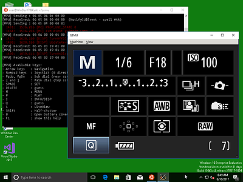
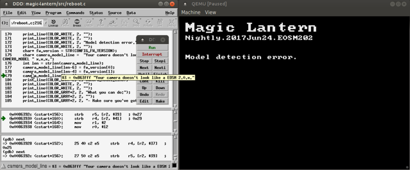

.. If you see this (unformatted) text on Bitbucket, please try reloading the page.

How can I run Magic Lantern in QEMU?
====================================

This guide shows you how to emulate Magic Lantern (or plain Canon firmware) in QEMU.

.. class:: align-center

|pic1| |pic2|


.. |pic2| image:: doc/img/qemu-M2-hello.jpg
    :width: 32.3 %

.. contents::

Current state
-------------

What works:

- Canon GUI with menu navigation — most DIGIC 3, 4 and 5 models
- Limited support for DIGIC 2, 6 and 7 models
- Limited support for some PowerShot models (including recent EOS M models)
- Limited support for secondary DryOS cores (such as Eeko or 5D4 AE processor)
- File I/O works on most models (both SD and CF); might be unreliable
- Bootloader emulation works on all supported models (from DIGIC 2 to DIGIC 7)
- Loading AUTOEXEC.BIN / DISKBOOT.BIN from the virtual SD/CF card (from DIGIC 2 to DIGIC 7)
- Unmodified autoexec.bin works on many single-core camera models
  (and, with major limitations, on dual-core models)
- ML modules and Lua scripts (within the limitations of the emulation)
- DryOS/VxWorks timer (heartbeat) and task switching (all supported models)
- UART emulation (DryOS shell aka Dry-shell or DrySh on DIGIC 4, 5, 6 and 7 models)
- Deterministic execution with the ``-icount`` option (except CF PIO)
- Cache hacks are emulated to some extent, but not exactly accurate
- EDMAC memcpy, including geometry parameters (matches the hardware closely, but not perfectly)
- Debugging with GDB:

  - assembly level for Canon code
  - source level for ML code (if compiled with -ggdb3 or similar)
  - ML stubs can be loaded as debugging symbols for Canon code (todo: also import from IDA or other systems)
  - predefined GDB scripts (log calls to DebugMsg, task_create, register_interrupt and a few others)
  - front-ends tested: cgdb (``splitgdb.sh``), DDD, gdbgui

  |

- Debug messages at QEMU console:

  - Use qprintf / qprint / qprintn / qdisas for printing to QEMU console
  - Compile Magic Lantern with ``CONFIG_QEMU=y``
  - By default (``CONFIG_QEMU=n``), the debug messages are not compiled
    (therefore not increasing the size of the executable that runs on the camera)

  |

- Log various actions of the guest operating system (Canon firmware, ML):

  - execution trace: ``-d exec,nochain -singlestep``
  - I/O trace: ``-d io``, ``-d io,int``
  - log hardware devices: ``-d mpu/sflash/sdcf/uart/int``
  - log all debug messages from Canon: ``-d debugmsg``
  - log all memory accesses: ``-d rom/ram/romr/ramw/etc``
  - log all function calls: ``-d calls``
  - log all DryOS/VxWorks task switches: ``-d tasks``
  - track all function calls to provide a stack trace: ``-d callstack``
  - export all called functions to IDC script: ``-d idc``
  - identify memory blocks copied from ROM to RAM: ``-d romcpy``
  - check for memory errors (a la valgrind): ``-d memchk``
  - list all available items: ``-d help`` 

What does not work (yet):

- LiveView (WIP, very hard);
- Still photo capture (WIP — the capture process itself works);
- Image review (WIP);
- Dual core emulation aka IPC (WIP);
- Touch screen (TODO);
- Flash reprogramming (TODO, low priority);
- Most hardware devices (audio chip, ADTG, FPGAs, JPCORE, image processing engine...);
- MPU properties are working to some extent, but have major limitations and bugs;
- Lens communication (done via MPU); initial lens info is replayed on startup on some models, but that's pretty much it;
- Cache behavior is not emulated (very hard; feel free to point us to code that can be reused);
- Native Windows build (QEMU can be compiled on Windows => contribution welcome).

Common issues and workarounds
`````````````````````````````

- Camera was not shut down cleanly — Skipping module loading

  - closing QEMU window does not perform a clean shutdown
  - ``Machine -> Power Down`` — see `Shutdown and reboot`_ for more info
  - quicker: press ``C`` to `"open" the card door`__ => also clean shutdown.

__ `Opening the card door`_

.. _netcat-issue:

- Netcat issues when interacting with ``qemu.monitor``

  There are many versions of netcat around.
  Newer variants of openbsd netcat
  (`since 1.111, Mar 2013 <https://cvsweb.openbsd.org/cgi-bin/cvsweb/src/usr.bin/nc/netcat.c.diff?r1=1.110&r2=1.111&f=h>`_)
  require ``-N``, but older versions do not have ``-N`` and will print an error if you attempt to use it. GNU netcat or other variants were not tested.
  
  TLDR: try openbsd netcat. If you get an error after copy/pasting some ``nc`` command from this guide, simply remove the ``-N``.
  
  Look in ``run_tests.sh`` for a slightly more portable workaround.
  

Installation
------------

It is recommended to install from the `qemu <https://bitbucket.org/hudson/magic-lantern/branch/qemu>`_
branch, as it will contain the latest developments. The installation will be performed
outside the main magic-lantern directory, therefore you will be able to emulate any ML branch
without additional gymnastics (you will **not** have to merge ``qemu`` into your working branch or worry about it).

1. Clone the ``magic-lantern`` repository if you haven't already:

   .. code:: shell

     hg clone https://bitbucket.org/hudson/magic-lantern
     cd magic-lantern

   |

2. Run ``install.sh`` from the ``qemu`` branch:

   .. code:: shell

     /path/to/magic-lantern$  hg update qemu -C
     /path/to/magic-lantern$  cd contrib/qemu
     /path/to/magic-lantern/contrib/qemu$  ./install.sh

   By default, QEMU will be installed in the ``qemu-eos`` directory,
   near the ``magic-lantern`` one, at the same level - e.g. ``/path/to/qemu-eos``.
   Please refer to `HACKING.rst <HACKING.rst#rst-header-how-is-this-code-organazized>`__
   for details on the directory structure and how to change the installation directory.

   |

3. Follow the instructions; you will have to supply your ROM files and compile QEMU:

   .. code:: shell

     # replace camera model (60D) with yours
     /path/to/qemu-eos$  cp /path/to/sdcard/ML/LOGS/ROM*.BIN 60D/
     /path/to/qemu-eos$  cd qemu-2.5.0
     /path/to/qemu-eos/qemu-2.5.0$  ../configure_eos.sh
     /path/to/qemu-eos/qemu-2.5.0$  make -j2
     /path/to/qemu-eos/qemu-2.5.0$  cd ..

   Some recent camera models also use a serial flash. To list them, run this command:

   .. code:: shell
   
     cat qemu-2.5.0/hw/eos/model_list.c | grep -B 10 serial_flash_size | grep -E "\.(serial_flash_size|name) "

   or just watch out for an error about missing ``SFDATA.BIN`` when trying the next step.

   If your camera requires a serial flash, compile the 
   `sf_dump module <https://bitbucket.org/hudson/magic-lantern/src/unified/modules/sf_dump>`_
   and run it on your camera to get this file.

   |

4. Test your installation.

   The pre-installed SD/CF images come with a small autoexec.bin
   (the `portable display test <http://www.magiclantern.fm/forum/index.php?topic=14732.0>`_)
   that works on all supported EOS models. It does not work on PowerShot models
   (including recent EOS M models based on PowerShot firmware).

   .. code:: shell
 
     # all EOS models should run this without any trickery
     /path/to/qemu-eos$  ./run_canon_fw.sh 60D,firmware="boot=1"

   |

5. Compile and run Magic Lantern

   .. code:: shell

     # from the QEMU directory
     /path/to/qemu-eos$  make -C ../magic-lantern 60D_install_qemu
     
     # some models will work only with this:
     /path/to/qemu-eos$  ./run_canon_fw.sh 60D,firmware="boot=1"

     # some models require running under GDB (they won't boot the GUI otherwise)
     /path/to/qemu-eos$  ./run_canon_fw.sh EOSM,firmware="boot=1" -s -S & arm-none-eabi-gdb -x EOSM/patches.gdb -ex quit

   |

For reference, you may also look at `our test suite <http://builds.magiclantern.fm/jenkins/view/QEMU/job/QEMU-tests/lastSuccessfulBuild/console>`_,
where QEMU is installed from scratch every time the tests are run.
These logs can be very useful for troubleshooting.

While we don't provide a native Windows build yet,
it is possible to install QEMU and ML development tools
`under the Windows 10 Linux Subsystem (WSL) <http://www.magiclantern.fm/forum/index.php?topic=20214.0>`_.

Running Canon firmware
----------------------

From the ``qemu-eos`` directory, use the ``run_canon_fw.sh`` script and make sure
the `boot flag <http://magiclantern.wikia.com/wiki/Bootflags>`_ is disabled:

.. code:: shell

  # from the qemu-eos directory
  ./run_canon_fw.sh 60D,firmware="boot=0"

Some models may need additional patches to run — these are stored under ``CAM/patches.gdb``.
To emulate these models, you will also need ``arm-none-eabi-gdb`` or ``gdb-multiarch``:

.. code:: shell

  ./run_canon_fw.sh EOSM,firmware="boot=0" -s -S & arm-none-eabi-gdb -x EOSM/patches.gdb -ex quit

You'll probably want to `see a few internals`__ as well. To get started, try these:

__ `Tracing guest events (execution, I/O, debug messages, RAM, function calls...)`_

.. code:: shell

  ./run_canon_fw.sh 60D,firmware="boot=0" -d debugmsg
  ./run_canon_fw.sh 60D,firmware="boot=0" -d debugmsg,tasks
  ./run_canon_fw.sh 60D,firmware="boot=0" -d debugmsg,io
  ./run_canon_fw.sh 60D,firmware="boot=0" -d io,int
  ./run_canon_fw.sh 60D,firmware="boot=0" -d help

Or you may want to `run the firmware under GDB`__ and log additional functions:

__ `Debugging with GDB`_

.. code:: shell

  ./run_canon_fw.sh 60D,firmware="boot=0" -s -S & arm-none-eabi-gdb -x 60D/debugmsg.gdb
  ./run_canon_fw.sh 60D,firmware="boot=0" -s -S & gdb-multiarch -x 60D/debugmsg.gdb

Running Magic Lantern
---------------------

As you already know, Magic Lantern runs from the SD or CF card. For emulation,
we provide two card images (``sd.img`` and ``cf.img``) which you can mount on your operating system
and copy files on them. If these images use a FAT filesystem (they do, by default), we prefer 
`mtools <https://www.gnu.org/software/mtools/>`_ for automated tasks
(such as copying files to/from the card images without mounting them).

To install Magic Lantern to the virtual card, you may:

- mount the card image (``sd.img`` or ``cf.img``) as ``/whatever/EOS_DIGITAL``,
  then run ``make install`` from your platform directory:

  .. code:: shell

    # from the magic-lantern directory
    cd platform/60D.111
    make clean; make
    # make sure your virtual card is mounted (this step is operating system specific)
    make install
    # make sure your virtual card is no longer mounted

  |

- use ``make install_qemu`` from your platform directory, or ``make CAM_install_qemu`` 
  or ``make CAM.FW_install_qemu`` from your ML root directory
  (requires mtools, but you do not have to mount your card images;
  works since `27f4105 <https://bitbucket.org/hudson/magic-lantern/commits/27f4105cfa83>`_):

  .. code:: shell

    # from the magic-lantern directory
    cd platform/60D.111
    make clean; make
    make install_qemu

  .. code:: shell

    # from the magic-lantern directory
    make 60D_clean
    make 60D_install_qemu

  They also work from the ``qemu-eos`` directory:

  .. code:: shell

    # from the qemu-eos directory
    make -C ../magic-lantern/platform/60D.111 clean
    make -C ../magic-lantern/platform/60D.111 install_qemu

  .. code:: shell

    # from the qemu-eos directory
    make -C ../magic-lantern 5D3.113_clean
    make -C ../magic-lantern 5D3.113_install_qemu

  Please note: ``make install_qemu`` is a recent addition and may not be available in all branches.
  In this case, you may either use the first method, or sync with the "unified" branch (``hg merge unified``),
  or manually import changeset `d5ad86f <https://bitbucket.org/hudson/magic-lantern/commits/d5ad86f0d284>`_.
  Unfortunately, these rules won't work from ``Makefile.user``.

The included card images are already bootable for EOS firmwares (but not for PowerShots).

After you have copied Magic Lantern to the card, you may run it from the ``qemu-eos`` directory
(near the ``magic-lantern`` one, at the same level):

.. code:: shell

  # from the qemu-eos directory
  ./run_canon_fw.sh 60D,firmware="boot=1"
  
  # or, if your camera requires patches.gdb:
  ./run_canon_fw.sh EOSM,firmware="boot=1" -s -S & arm-none-eabi-gdb -x EOSM/patches.gdb -ex quit

Navigating menus
````````````````

Press ``F1`` to show the available keys (they are model-specific), or just read them
from the emulation log. Some keys will only send "press" events, while others
will send "press and release" events (this is also model-specific
and printed on the console).

Scrollwheels, if turned very quickly, may send a single event that includes
more than one click. This complicates scrollwheel handling code on ML side
and often leads to subtle issues. Currently, this behavior is not emulated.

Shutdown and reboot
```````````````````

By default, closing the QEMU window is equivalent to unplugging the power cord
(if your camera is on external power source). This appears to be the default
with other operating systems as well, so we did not change it.

Please note: closing QEMU window is **not** equivalent to taking the battery out —
see `Opening the battery door`_ for details.

Shutting down
'''''''''''''

To perform a clean shutdown (similar to powering down the camera from the main switch),
you may:

- select ``Machine -> Power Down`` from the menu (QEMU window)
- send the ``system_powerdown`` command to QEMU monitor:

.. code:: shell

  echo "system_powerdown" | nc -N -U qemu.monitor

Internally, Canon code refers to this kind of shutdown as ``SHUTDOWN_REQUEST``
(watch their debug messages with ``-d debugmsg``).

Caveat: the ``system_powerdown`` event does not guarantee a shutdown will actually occur
(either because the firmware handles this event in a different way, or if the execution
gets stuck for any reason). As a workaround, you could issue the ``quit`` command
after some timeout, if QEMU is still running:

.. code:: shell

  echo "system_powerdown" | nc -N -U qemu.monitor
  sleep 2
  if nc -N -U qemu.monitor < /dev/null > /dev/null 2>&1; then
    echo "quit" | nc -N -U qemu.monitor
  fi

Opening the card door
'''''''''''''''''''''

Opening the SD/CF card door is a clean (non-rushed) way to shut down Canon firmware (``SHUTDOWN_REQUEST``).
To emulate this kind of shutdown, press ``C`` to simulate opening the card door,
then wait for a few seconds for QEMU to shutdown.

Opening the card door and closing it back quickly enough may result
in shutdown being canceled. Closing the card door is not implemented,
therefore this behavior is not emulated yet.

Opening the battery door
''''''''''''''''''''''''

Opening the battery door is interpreted by Canon firmware as an emergency shutdown (``PROP_ABORT``),
but it's still a clean(ish) shutdown. To emulate this kind of shutdown, press ``B``,
then close the QEMU window manually (or send the ``quit`` command to QEMU monitor).
Currently we do not know how to trigger or recognize a hardware shutdown event.

Rebooting
'''''''''

The camera can be rebooted from software by triggering ``PROP_REBOOT``.
Canon firmware handles it as a regular shutdown (``SHUTDOWN_REQUEST``),
followed by a regular boot. In QEMU, triggering ``PROP_REBOOT`` from software
will perform a clean shutdown (rebooting is not implemented).

Running ML Lua scripts
``````````````````````

- Install ML on the virtual SD card:

  .. code:: shell

    # from the qemu-eos directory
    wget http://builds.magiclantern.fm/jenkins/job/lua_fix/431/artifact/platform/60D.111/magiclantern-lua_fix.2017Dec23.60D111.zip
    unzip magiclantern-lua_fix.2017Dec23.60D111.zip -d ml-tmp
    ./mtools_copy_ml.sh ml-tmp
    rm -rf ml-tmp/

  |

- Run QEMU:

  .. code:: shell

    ./run_canon_fw.sh 60D,firmware="boot=1"

  |

- enable the Lua module
- reboot the virtual camera cleanly (menu: Machine -> Power Down, then start it again)
- run the Hello World script

Note: api_test.lua does not run completely, but `can be patched <http://www.magiclantern.fm/forum/index.php?topic=2864.msg195347#msg195347>`_.

TODO: make api_test.lua run, fix bugs, polish the guide.

Using multiple firmware versions
````````````````````````````````

In most cases, Magic Lantern only supports one firmware version, to keep things simple.
However, there may be good reasons to support two firmware versions
(for example, on the 5D Mark III, there are valid reasons to choose
both `1.1.3 <http://www.magiclantern.fm/forum/index.php?topic=14704.0>`_
and `1.2.3 <http://www.magiclantern.fm/forum/index.php?topic=11017.0>`_)
or you may want to test both versions when porting Magic Lantern
`to a newer Canon firmware <http://www.magiclantern.fm/forum/index.php?topic=19417.0>`_.

The invocation looks like this (notice the ``113``):

.. code:: shell

  ./run_canon_fw.sh 5D3,firmware="113;boot=0" -s -S & arm-none-eabi-gdb -x 5D3/debugmsg.gdb

And the directory layout should be like this::

  /path/to/qemu-eos/5D3/113/ROM0.BIN
  /path/to/qemu-eos/5D3/113/ROM1.BIN
  /path/to/qemu-eos/5D3/123/ROM0.BIN
  /path/to/qemu-eos/5D3/123/ROM1.BIN
  /path/to/qemu-eos/5D3/113/ROM0.BIN
  /path/to/qemu-eos/5D3/debugmsg.gdb  # common to both versions
  /path/to/qemu-eos/5D3/patches.gdb   # common to both versions

Compare this to a camera model where only one firmware version is supported::

  /path/to/qemu-eos/60D/ROM0.BIN
  /path/to/qemu-eos/60D/ROM1.BIN
  /path/to/qemu-eos/5D3/patches.gdb

You may also store ``debugmsg.gdb`` and ``patches.gdb`` under the firmware version subdirectory if you prefer, but other QEMU-related scripts won't pick them up.

Creating custom SD/CF card images
`````````````````````````````````

You may want to run the emulation using the same card contents as on the physical camera
(for example, for troubleshooting). The recommended way is to create an image
of your SD (or CF) card (`tutorial for Windows and Mac <https://thepihut.com/blogs/raspberry-pi-tutorials/17789160-backing-up-and-restoring-your-raspberry-pis-sd-card>`_):

.. code:: shell

  dd if=/dev/your-sd-card of=sd.img bs=1M

and run QEMU from the resulting ``sd.img`` (or ``cf.img``).

Note: you need to copy the raw contents of the entire card, not just one partition. For example:

.. code:: shell

  dd if=/dev/mmcblk0 of=sd.img    # not mmcblk0p1

Tip: to save disk space, format the SD card first, copy the desired files,
then create the image as `qcow2 <https://rwmj.wordpress.com/2010/05/18/tip-compress-raw-disk-images-using-qcow2/>`_:

.. code:: shell

  qemu-img convert -f raw -O qcow2 /dev/mmcblk0 sd.qcow2

then update ``run_canon_fw.sh`` to use the new image::

  -drive if=sd,format=qcow2,file=sd.qcow2

That way, a 64GB card with Magic Lantern installed, after formatting in camera
with the option to keep ML on the card, will only take up about 15MB as a ``qcow2`` image.

Running from the physical SD/CF card
````````````````````````````````````
You may also start QEMU from the same card you use in the physical camera — 
this might be useful for troubleshooting issues with Magic Lantern, 
hopefully including certain card compatibility issues.

It is **strongly** recommended to avoid this procedure, unless absolutely needed.
Please consider creating an image of your SD (or CF) card instead, as described above.

If you still wish to run the emulation directly from a physical SD/CF card:

- See `QEMU docs (Using host drives) <https://qemu.weilnetz.de/doc/qemu-doc.html#Using-host-drives>`_
  and make sure you understand `these warnings <https://wiki.archlinux.org/index.php/QEMU#Using_any_real_partition_as_the_single_primary_partition_of_a_hard_disk_image>`_
- Replace ``file=sd.img`` (or ``file=cf.img``) with ``file=/dev/your-sd-card`` in ``run_canon_fw.sh``
- Configure the appropriate permissions and run the emulation as usual.

**Warning: Canon firmware WILL write to the SD/CF card during startup, 
and might even attempt to format it if the filesystem is not recognized,
or because of emulation bugs. 
Be very careful not to give it write access to your physical hard-disk!!!**

Note: the ROM files will not be loaded from the SD/CF card.

Image capture emulation
```````````````````````

WIP, still pretty rough.

To capture a full-res image (aka FRSP) using a CR2 as reference data for the virtual sensor:

.. code:: shell

    make -C ../magic-lantern/minimal/qemu-frsp MODEL=5D3 CONFIG_QEMU=y clean install_qemu
    env QEMU_EOS_VRAM_PH_QR_RAW='/path/to/IMG_1234.CR2' ./run_canon_fw.sh 5D3,firmware="boot=1"


Automation
----------

QEMU monitor
````````````

By default, the QEMU monitor console is available by default as a UNIX socket.
That means, during emulation you can interact with it using netcat:

- interactive console

  .. code:: shell

    nc -N -U qemu.monitor

  |

- one-liner commands, usable from scripts:

  .. code:: shell

    echo "log io" | nc -N -U qemu.monitor

  |

- check whether QEMU monitor is active:

  .. code:: shell

    if nc -N -U qemu.monitor < /dev/null > /dev/null 2>&1; then
      ...
    fi

  |

You can redirect the monitor console to stdio with... ``-monitor stdio``.

If you have trouble running the above ``nc`` commands, don't forget to check this `common netcat issue`__.

__ `netcat-issue`_

Taking screenshots
``````````````````

The easiest way is to use the ``screendump`` command from QEMU monitor:

.. code:: shell

  echo "screendump snap.ppm" | nc -N -U qemu.monitor

In the following example, we'll redirect the monitor to stdio
and take a screenshot after 10 seconds:

.. code:: shell

  ( 
    sleep 10
    echo screendump snap.ppm
    echo system_powerdown
  ) | (
    ./run_canon_fw.sh 60D,firmware='boot=0' \
        -monitor stdio
  )

Another option is to use the VNC interface:

.. code:: shell

  ./run_canon_fw.sh 60D,firmware='boot=0' \
        -vnc :1234 &
  sleep 10
  vncdotool -s :1234 capture snap.png
  echo "system_powerdown" | nc -N -U qemu.monitor

Sending keystrokes
``````````````````

From QEMU monitor::

  (qemu) help
  sendkey keys [hold_ms] -- send keys to the VM (e.g. 'sendkey ctrl-alt-f1', default hold time=100 ms)

.. code:: shell

  ( 
    sleep 10
    echo sendkey m
    sleep 1
    echo screendump menu.ppm
    echo system_powerdown
  ) | (
    ./run_canon_fw.sh 60D,firmware='boot=0' \
        -monitor stdio
  )

Or, if QEMU runs as a background process:

.. code:: shell

  ./run_canon_fw.sh 60D,firmware='boot=0' &
  
  sleep 10
  echo "sendkey m" | nc -N -U qemu.monitor
  sleep 1
  echo "screendump menu.ppm" | nc -N -U qemu.monitor
  echo "system_powerdown" | nc -N -U qemu.monitor

From VNC:

.. code:: shell

  vncdotool -h | grep key
  key KEY               send KEY to server, alphanumeric or keysym: ctrl-c, del
  keyup KEY             send KEY released
  keydown KEY           send KEY pressed

.. code:: shell

  ./run_canon_fw.sh 60D,firmware='boot=0' \
        -vnc :1234 &
  sleep 10
  vncdotool -s :1234 key m
  sleep 1
  vncdotool -s :1234 capture menu.png
  echo "system_powerdown" | nc -N -U qemu.monitor

Running multiple ML builds from a single command
````````````````````````````````````````````````

You may run ML builds from multiple models, unattended,
with the ``run_ml_all_cams.sh`` script:

.. code:: shell

  env ML_PLATFORMS="500D.111/ 60D.111/" \
      TIMEOUT=10 \
      SCREENSHOT=1 \
      ./run_ml_all_cams.sh

Internally, this is how the emulator is invoked:

.. code:: shell

  ( 
    sleep 10
    echo screendump 60D.111.ppm
    echo system_powerdown
  ) | (
    ./run_canon_fw.sh 60D,firmware='boot=1' \
        -display none -monitor stdio
  ) &> 60D.111.log


This script is very customizable (see the source code for available options).

**More examples:**

- `EOSM2 hello world <http://builds.magiclantern.fm/jenkins/view/QEMU/job/QEMU-EOSM2/18/console>`_
- running ML from the dm-spy-experiments branch in the emulator (`QEMU-dm-spy <http://builds.magiclantern.fm/jenkins/view/QEMU/job/QEMU-dm-spy/65/consoleFull>`_)
- running the FA_CaptureTestImage test based on the minimal ML target (`QEMU-FA_CaptureTestImage <http://builds.magiclantern.fm/jenkins/view/QEMU/job/QEMU-FA_CaptureTestImage>`_)

Parallel execution
``````````````````

On modern machines, you will get significant speed gains by running multiple instances of QEMU in parallel.
This is tricky and not automated. You need to be careful with the following global resources:

- SD and CF images (``sd.img`` and ``cf.img``):

  If all your parallel instances require the same initial SD/CF card contents,
  and you do not need to inspect the changes to SD/CF after the experiment,
  you may use these files as read-only shared resources with the help of QEMU's
  `temporary snapshot <https://wiki.qemu.org/Documentation/CreateSnapshot#Temporary_snapshots>`_ feature
  (simply add ``-snapshot`` to your command line). This will discard any changes to ``sd.img`` and ``cf.img``.
  `Implementation details <https://lists.gnu.org/archive/html/qemu-devel/2008-09/msg00712.html>`_.

  Otherwise, you could allocate different SD/CF images for each instance, but it's up to you to modify the scripts to handle that.

- QEMU monitor socket (``qemu.monitor``):

  Set the ``QEMU_JOB_ID`` environment variable; it will be used as suffix for ``qemu.monitor``.
  
  Example: ``QEMU_JOB_ID=1 ./run_canon_fw.sh 5D3`` will use ``qemu.monitor1`` for monitor commands.

- GDB port (with ``-s -S``, this port is 1234):

  Set QEMU_JOB_ID to a small positive integer, for example:

  .. code:: shell

    export QEMU_JOB_ID=1
  
  Then you'll be able to do this:

  .. code:: shell

    QEMU_MONITOR=qemu.monitor$QEMU_JOB_ID
    GDB_PORT=$((1234+QEMU_JOB_ID))
    ./run_canon_fw.sh EOSM2,firmware="boot=0" -S -gdb tcp::$GDB_PORT &
    arm-none-eabi-gdb -ex "set \$TCP_PORT=$GDB_PORT" -x EOSM2/patches.gdb -ex quit &
    
    # interact with monitor commands
    sleep 5
    echo "sendkey m" | nc -N -U $QEMU_MONITOR
    sleep 1

    # quit when finished
    echo "quit" | nc -N -U $QEMU_MONITOR

  |

- VNC display

  Same as above:

  .. code:: shell

    QEMU_MONITOR=qemu.monitor$QEMU_JOB_ID
    VNC_DISP=":$((12345+QEMU_JOB_ID))"
    ./run_canon_fw.sh 5D3,firmware="boot=0" -vnc $VNC_DISP &
    
    # interact with vncdotool
    sleep 5
    vncdotool -s $VNC_DISP key m
    sleep 1
    
    # quit when finished
    echo "quit" | nc -N -U $QEMU_MONITOR

  |

- any temporary files you may want to use

  Try to achieve the same thing without a temporary file (pipes, process substitution, command-line options).
  If that doesn't work, consider using ``mktemp`` rather than hardcoding a filename.

- any other global resources (you'll have to figure them out on your own).

TODO: can this be automated somehow with containers?

Debugging
---------

From the QEMU monitor
`````````````````````

.. code:: shell

  echo "help" | ./run_canon_fw.sh 60D -monitor stdio |& grep dump
  ...
  pmemsave addr size file -- save to disk physical memory dump starting at 'addr' of size 'size'
  xp /fmt addr -- physical memory dump starting at 'addr'

Using ``qprintf`` and friends
`````````````````````````````

The QEMU debugging API
(`qemu-util.h <https://bitbucket.org/hudson/magic-lantern/src/qemu/src/qemu-util.h>`_, included by default by ``dryos.h``)
exposes the following functions to be used in Magic Lantern code:

:qprintf: heavyweight, similar to printf; requires vsnprintf from Canon code
:qprint: lightweight, inline, similar to puts, without newline
:qprintn: lightweight, prints a 32-bit integer
:qdisas: lightweight, tells QEMU to disassemble one ARM or Thumb instruction at the given address

These functions will print to QEMU console whenever ML (or a subset of it)
is compiled with ``CONFIG_QEMU=y``. They won't get compiled in regular builds
(``CONFIG_QEMU=n`` is the default), therefore they won't increase the executable size.
For this reason, feel free to use them *anywhere*.

You may use the debugging API for either the entire ML, or just for a subset of it —
e.g. the source file(s) you are currently editing, or only some modules.
The lightweight functions can also be used in very early boot code,
where you can't call vsnprintf or you may not even have a stack properly set up.

CONFIG_QEMU
```````````

:``CONFIG_QEMU=n``: (default):

- regular build
- the executable works in QEMU (within the limitations of the emulation)
- no guest debugging code (no additional debugging facilities)

:``CONFIG_QEMU=y``: (optional, on the command line or in ``Makefile.user``):

- debug build for QEMU only
- does **not** run on the camera (!)
- enables ``qprintf`` and friends to print to the QEMU console
- enables unlimited number of ROM patches — useful for 
  `dm-spy-experiments <http://www.magiclantern.fm/forum/index.php?topic=2388.0>`_
  (in QEMU you can simply write to ROM as if it were RAM)
- may enable workarounds for models or features that are not emulated very well

Example:

.. code:: shell

    cd platform/550D.109
    make clean; make                            # regular build
    make clean; make CONFIG_QEMU=y              # debug build for QEMU
    make clean; make install_qemu               # build and install a regular build to the QEMU SD/CF image
    make clean; make install_qemu CONFIG_QEMU=y # build and install a QEMU build to the QEMU SD/CF image

It works for modules as well:

.. code:: shell

    cd modules/lua
    # add some qprintf call in lua_init for testing
    make clean; make                            # regular build
    make clean; make CONFIG_QEMU=y              # debug build for QEMU
    make clean; make install_qemu               # build and install a regular build to the QEMU SD/CF image
    make clean; make install_qemu CONFIG_QEMU=y # build and install a QEMU build to the QEMU SD/CF image
 
Tracing guest events (execution, I/O, debug messages, RAM, function calls...)
`````````````````````````````````````````````````````````````````````````````

Execution trace:

.. code:: shell

  ./run_canon_fw.sh 60D,firmware="boot=0" -d exec,nochain -singlestep

I/O trace (precise):

.. code:: shell

  ./run_canon_fw.sh 60D,firmware="boot=0" -d io

I/O trace (quick):

.. code:: shell

  ./run_canon_fw.sh 60D,firmware="boot=0" -d io_quick

I/O trace with interrupts (precise):

.. code:: shell

  ./run_canon_fw.sh 60D,firmware="boot=0" -d io,int

I/O trace with Canon debug messages (precise):

.. code:: shell

  ./run_canon_fw.sh 60D,firmware="boot=0" -d debugmsg,io

Canon debug messages and task switches:

.. code:: shell

  ./run_canon_fw.sh 60D,firmware="boot=0" -d debugmsg,tasks

Memory access trace (ROM reads, RAM writes) — very verbose:

.. code:: shell

  ./run_canon_fw.sh 60D,firmware="boot=0" -d romr,ramw

Call/return trace, redirected to a log file:

.. code:: shell

  ./run_canon_fw.sh 60D,firmware="boot=0" -d calls &> calls.log

Tip: set your editor to highlight the log file as if it were Python code.
You'll get collapse markers for free :)

Also with debug messages, I/O events and interrupts, redirected to file

.. code:: shell

  ./run_canon_fw.sh 60D,firmware="boot=0" -d debugmsg,calls,io,int &> full.log

Filter the logs with grep:

.. code:: shell

  ./run_canon_fw.sh 60D,firmware="boot=0" -d debugmsg,io |& grep --text -C 5 "\[Display\]"

Only log autoexec.bin activity (skip logging the bootloader):

.. code:: shell

  ./run_canon_fw.sh 60D,firmware="boot=1" -d exec,io,int,autoexec


Execution trace incomplete? PC values from MMIO logs not correct?
'''''''''''''''''''''''''''''''''''''''''''''''''''''''''''''''''

That's because QEMU compiles multiple guest instructions into a single TranslationBlock,
for faster execution. In this mode, ``-d exec`` will print guest instructions as they are compiled
(for example, if you have a tight loop, only the first pass will be printed).

To log every single guest instruction, as executed, and get exact PC values
in execution traces and other logs, you need to use ``-d nochain -singlestep`` 
(for example: ``-d exec,nochain -singlestep``) —
`source <http://qemu-discuss.nongnu.narkive.com/f8A4tqdT/singlestepping-target-assembly-instructions>`_.

Please note: ``-d io`` implies ``-d nochain -singlestep`` by default, to avoid this issue. Should you want to disable this,
to get faster emulation at the expense of incorrect PC values, use ``-d io_quick``.

Additionally, ``-d nochain`` implies ``-singlestep``, unlike in vanilla QEMU.

Debugging with GDB
``````````````````

.. code:: shell

    ./run_canon_fw.sh EOSM2,firmware="boot=1" -s -S & arm-none-eabi-gdb -x EOSM2/debugmsg.gdb

Logging hooks
'''''''''''''

Probably the most powerful feature of GDB is its scripting engine —
in many cases it's a lot faster than manually stepping over assembly code.
We may use it for tracing various function calls in the firmware, to understand what they do,
how to call them and so on. At any code address from the disassembly, we may set a breakpoint
and print some more info (such as function name, arguments, register values,
call location, DryOS task name and so on).

Predefined logging hook example (this goes into ``CAM/debugmsg.gdb``)::

  b *0x8580
  take_semaphore_log

Custom logging hook (with colors)::

  b *0xE0008DA6
  commands
    silent
    print_current_location
    KRED
    printf "dryos_panic(%x, %x)\n", $r0, $r1
    KRESET
    c
  end

Look in `debug-logging.gdb <https://bitbucket.org/hudson/magic-lantern/src/qemu/contrib/qemu/scripts/debug-logging.gdb#debug-logging.gdb>`_
for common firmware functions you may want to log, and in ``*/debugmsg.gdb`` for usage examples.

You may also use `dprintf <https://sourceware.org/gdb/onlinedocs/gdb/Dynamic-Printf.html>`_ if you prefer::

  dprintf *0x8b10, "[ %s:%08X ] task_create(%s, prio=%x, stack=%x, entry=%x, arg=%x)\n", CURRENT_TASK_NAME, $lr-4, $r0, $r1, $r2, $r3, *(int*)$sp

but the output won't be as pretty.

To log the return value of any function, use ``log_result`` in the definition of a logging hook.

For quick experiments, you may find ``generic_log`` and ``generic_log_with_result`` handy.

Debugging symbols
'''''''''''''''''

There are no debugging symbols in Canon firmware, but you can import
some of them from Magic Lantern (see comments in ``debugmsg.gdb``). Typically, you want to use one of these
`elf <https://jvns.ca/blog/2014/09/06/how-to-read-an-executable/>`_ files
from the platform directory:

- ``magiclantern`` if debugging regular Magic Lantern code (without modules)
- ``autoexec`` if debugging ML bootloader code — the `reboot shim <http://magiclantern.wikia.com/wiki/Autoboot>`_ (``reboot.c`` and related)
- ``stubs.o`` if debugging Canon firmware (add your symbols to ``stubs.S`` and recompile.)

For some reason, ML stubs are not recognized as functions in GDB;
to set breakpoints on function names, you need this trick::

  b *&task_create
  task_create_log

Printing call stack from GDB
''''''''''''''''''''''''''''

The ``callstack`` option from QEMU (``eos/dbi/logging.c``) can be very useful to find where a function was called from.
This works even when gdb's ``backtrace`` command cannot figure it out from the stack contents, does not require any debugging symbols,
but you need to run the emulation with instrumentation enabled: ``-d callstack``.

Then, in GDB, use ``print_current_location_with_callstack`` to see the call stack for the current DryOS task.

Tip: the callstack feature is enabled by default in ``assert_log``.

**Example for 80D:**

The following goes into ``80D/debugmsg.gdb`` (modify the existing entry):

.. code::

  b *0xFE237C9E
  commands
    silent
    print_current_location_with_callstack
    printf "Memory region: start=%08X end=%08X flags=%08X\n", $r0, $r1, $r2
    c
  end

Start the emulation with:

.. code:: shell

  ./run_canon_fw.sh 80D,firmware="boot=0" -d callstack -s -S & arm-none-eabi-gdb -x 80D/debugmsg.gdb

Output:

.. code::

  ...
  Current stack: [2e9118-2e8118] sp=2e90c0                                         at [init:fe237c9e:fe238001]
  0xFE0D3385(0, fe0d3385, 19980218, 19980218)                                      at [init:8000173d:2e9108] (pc:sp)
   0xFE237E2D(0, feff65ab "Initialize SerialIO", 2e0f04, 44f4)                     at [init:fe0d403d:2e90f0] (pc:sp)
    0xFE237F93(18, 203a0, 0, 44f4)                                                 at [init:fe237e55:2e90d8] (pc:sp)
     0xFE237C9F(fe000000, ffffffff, 8, 5)                                          at [init:fe237ffd:2e90c0] (pc:sp)
  [        init:fe237ffd ] Memory region: start=FE000000 end=FFFFFFFF flags=00000008
  ...

The above shows the callers for the function being analyzed,
with 4 arguments (no attempts are made to guess the actual number of arguments)
and the locations for each call. You may examine these addresses in your disassembler.

GDB scripting docs
''''''''''''''''''

- `Sequences <https://sourceware.org/gdb/onlinedocs/gdb/Sequences.html>`_ (command files, define, if, while, printf)
- `Convenience variables <https://sourceware.org/gdb/current/onlinedocs/gdb/Convenience-Vars.html>`_
- `GDB user manual <https://sourceware.org/gdb/current/onlinedocs/gdb/index.html>`_.

More examples
'''''''''''''

- `750D serial flash dumper <http://www.magiclantern.fm/forum/index.php?topic=17627.msg195357#msg195357>`_ (figuring out the parameters of an unknown function)
- `EOS M2 <http://www.magiclantern.fm/forum/index.php?topic=15895.msg186173#msg186173>`_ (examples with various GDB GUI front-ends):

|




Instrumentation
---------------

`TODO (see QEMU forum thread) <http://www.magiclantern.fm/forum/index.php?topic=2864.msg184125#msg184125>`_

The instrumentation framework provides the following features:

- log all debug messages from Canon: ``-d debugmsg``
- log all memory accesses: ``-d rom/ram/romr/ramw/etc``
- log all function calls: ``-d calls``
- log all DryOS/VxWorks task switches: ``-d tasks``
- track all function calls to provide a stack trace: ``-d callstack``
- export all called functions to IDC script: ``-d idc``
- identify memory blocks copied from ROM to RAM: ``-d romcpy``
- check for memory errors (a la valgrind): ``-d memchk``

Debugging symbols from ML can be made available to instrumentation routines from environment variables (see ``export_ml_syms.sh``).

The address of DebugMsg is exported by ``run_canon_fw.sh`` (extracted from the GDB script, where it's commented out for speed reasons).

Development and reverse engineering guide
-----------------------------------------

For the following topics, please see `HACKING.rst <HACKING.rst>`_:

- Finding your way around the source code;
- Adding support for emulating a new camera model;
- EOS (and PowerShot) firmware internals and reverse engineering tips.

History
-------

:2008: `SD1100 boot (CHDK) <http://chdk.wikia.com/wiki/GPL_Qemu>`_
:2009: `5D2/7D boot (Trammell Hudson) <http://magiclantern.wikia.com/wiki/Emulation>`_
:2012: `TriX_EOS (g3gg0) <http://www.magiclantern.fm/forum/index.php?topic=2882.0>`_
:2013: `Initial Hello World <http://www.magiclantern.fm/forum/index.php?topic=2864.msg26022#msg26022>`_
:2013: `g3gg0 ports TriX changes to QEMU <http://www.magiclantern.fm/forum/index.php?topic=2864.msg29748#msg29748>`_
:2013: `Antony Pavlov submits initial DIGIC support to QEMU mainline <https://lists.gnu.org/archive/html/qemu-devel/2013-08/msg04509.html>`_
:2013: `Nikon Hacker is light years ahead us <http://www.magiclantern.fm/forum/index.php?topic=8823.0>`_ (we are not competing; it was just a fun notice that motivated us)
:2014: `DryOS task scheduler running! <http://www.magiclantern.fm/forum/index.php?topic=2864.msg117430#msg117430>`_ (also ML menu and modules, but with massive hacks — emulating only a very small part of Canon firmware)
:2015: `Portable display test and Linux PoC working! <http://www.magiclantern.fm/forum/index.php?topic=2864.msg144760#msg144760>`_
:2015: `Canon GUI boots on 60D! <http://www.magiclantern.fm/forum/index.php?topic=2864.msg148240#msg148240>`_ (no menus yet, but most Canon tasks are working!)
:2015: `100D emulation, serial flash and GDB scripts from nkls <http://www.magiclantern.fm/forum/index.php?topic=2864.msg153064#msg153064>`_
:2016: `More EOS models boot Canon GUI (no menus yet) <http://www.magiclantern.fm/forum/index.php?topic=2864.msg168603#msg168603>`_
:2016: `Low-level button codes and GUI modes understood <http://www.magiclantern.fm/forum/index.php?topic=2864.msg169517#msg169517>`_
:2016: `Users start wondering why the heck are we wasting our time on this <http://www.magiclantern.fm/forum/index.php?topic=2864.msg169970#msg169970>`_
:2016: `Leegong from Nikon Hacker starts documenting MPU messages <http://www.magiclantern.fm/forum/index.php?topic=17596.msg171304#msg171304>`_
:2017: `500D menu navigation! (Greg) <http://www.magiclantern.fm/forum/index.php?topic=2864.msg179867#msg179867>`_
:2017: `nkls solves an important issue that was very hard to track down! <http://www.magiclantern.fm/forum/index.php?topic=2864.msg183311#msg183311>`_
:2017: `Menu navigation works on most DIGIC 4 and 5 models <http://www.magiclantern.fm/forum/index.php?topic=2864.msg181786#msg181786>`_
:2017:  Working on `Mac (dfort) <http://www.magiclantern.fm/forum/index.php?topic=2864.msg184981#msg184981>`_ 
        and `Windows 10 / Linux subsystem (g3gg0) <http://www.magiclantern.fm/forum/index.php?topic=20214.0>`_
:2017: `EOS M2 porting walkthrough <http://www.magiclantern.fm/forum/index.php?topic=15895.msg185103#msg185103>`_
:2017: `Automated tests for ML builds in QEMU <http://www.magiclantern.fm/forum/index.php?topic=20560>`_
:2017: `RTC emulation, many patches no longer needed <http://www.magiclantern.fm/forum/index.php?topic=2864.msg190823#msg190823>`_ (g3gg0)
:2017: `Major progress with DIGIC 6 emulation <http://www.magiclantern.fm/forum/index.php?topic=17360.msg194898#msg194898>`_
:2017: `Menu navigation works on 20 EOS models! (DIGIC 3-5) <http://www.magiclantern.fm/forum/index.php?topic=2864.msg195117#msg195117>`_
:2018: `Initial support for DIGIC 7 EOS models (77D, 200D, 6D Mark II) <https://www.magiclantern.fm/forum/index.php?topic=19737.msg200799#msg200799>`_


Happy hacking!
